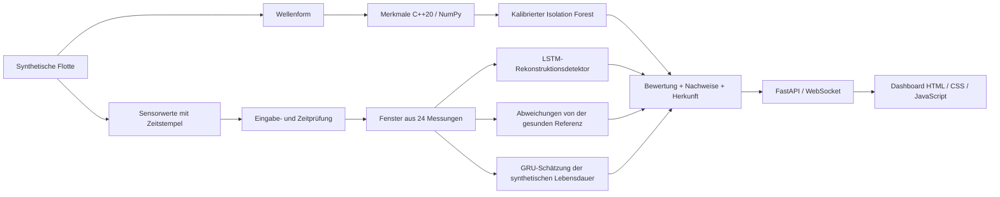

# ARGUS-NEURO

**Evidenzbasierte Diagnose für Leistungselektronik: Signalverarbeitung in C++20, ML-Modelle in Python und ein Live-Flotten-Dashboard.**

[Русский](README.md) · [English](README.en.md) · [中文](README.zh.md) · [हिन्दी](README.hi.md) · [Español](README.es.md) · [Français](README.fr.md) · **Deutsch** · [Italiano](README.it.md)

[Diagnosevertrag (Englisch)](docs/RELIABILITY.md) · [Evaluierungsnotizen (Englisch)](experiments/2026-09-30_reliability/notes.md)

ARGUS-NEURO ist ein funktionsfähiger Forschungsprototyp für maritime Umrichter und Stromverteilungseinheiten von UAVs. Die aktuelle Anwendung betreibt eine **synthetische Flotte** aus sechs Anlagen. Sie verarbeitet keine Telemetrie realer Geräte und ermittelt keine reale Restnutzungsdauer.

## Umgesetzte Funktionen

- **Entscheidungspässe.** Jede Bewertung enthält eine aus dem Inhalt abgeleitete ID, einen Fingerabdruck des Modellpakets, Sensornachweise und Erklärungen. Sie kennzeichnen den bewerteten Inhalt und die Modelle; sie sind weder digitale Signaturen noch Beweis für die Ursache eines Fehlers.
- **Explizite Enthaltung.** Fehlende oder nicht endliche Messwerte, ungültige Wellenformen, zeitliche Unterbrechungen, inkompatible Modelle und unzureichender Verlauf führen zu expliziten Status statt zu erfundenen Vorhersagen.
- **Diagnose gegenüber Sensorreferenzen.** Gerätetypspezifische gesunde Trainingsreferenzen erkennen anhaltende und wechselnde Abweichungen. Die Referenzen bleiben während der Inferenz fest, sodass eine sich verschlechternde Anlage nicht unbemerkt als normal gelernt wird.
- **Uneinigkeit der Detektoren.** Das Dashboard zeigt, wenn Spektral-, Rekonstruktions- und Referenzdetektor uneins sind. Ein einzelner positiver Detektor kann ohne Mehrheitsentscheid einen Alarm auslösen.
- **Konsistente Merkmale in nativem Code und NumPy.** Die 11 statistischen und spektralen Merkmale nutzen einen gemeinsamen FFT-Vertrag mit Nullauffüllung. Die pybind11-Erweiterung unterstützt Arrays mit Schrittweite und in umgekehrter Reihenfolge und gibt nach dem Kopieren der Eingabe den GIL frei.
- **Verbindungsbewusste Überwachung.** Das Dashboard markiert getrennte oder veraltete Datenströme, behält den letzten Snapshot und versucht die Verbindung erneut. Im Browser erzeugte Telemetrie startet nur durch eine ausdrückliche Demo-Aktion und trägt eine eigene Quellenkennzeichnung.
- **Oberfläche in acht Sprachen.** Russisch (Standard), Englisch, Chinesisch, Hindi, Spanisch, Französisch, Deutsch und Italienisch; die gewählte Sprache wird im Browser gespeichert.

Dies sind umgesetzte Produktentscheidungen, keine Behauptungen weltweiter Neuheit oder validierter industrieller Leistungsfähigkeit.

## Architektur



Die sechs Sensorkanäle sind in dieser Reihenfolge `voltage_v`, `current_a`, `temperature_c`, `vibration_g`, `frequency_hz` und `load_factor`. Der Simulator unterstützt Überhitzung, Lagerverschleiß, Spannungseinbruch, Frequenzdrift und Isolationsalterung. Die Live-Flotte zeigt vier Fehlerszenarien und zwei gesunde Anlagen.

## Voraussetzungen

Das Projekt wurde unter Ubuntu/Linux mit CPython 3.12, GCC 13, CMake 3.28 und Node.js 22 erprobt. Für den Bau der nativen Erweiterung werden ein C++20-Compiler und die Python-Entwicklungsheader benötigt. Python muss virtuelle Umgebungen anlegen können. Node wird nur für die Dashboard-Tests benötigt, nicht für den Betrieb der Anwendung.

Die Versionen der direkten Python-Abhängigkeiten sind in [python/requirements.txt](python/requirements.txt) festgelegt; [python/requirements-dev.txt](python/requirements-dev.txt) installiert zusätzlich Ruff. Das ist keine vollständige Sperre der transitiven Abhängigkeiten. Das Training protokolliert die Versionen seiner wichtigsten numerischen Bibliotheken in den Paketberichten.

## Ersteinrichtung unter Ubuntu

Im Wurzelverzeichnis des Repositorys ausführen:

```bash
bash scripts/setup_env.sh
bash scripts/train_all.sh
bash scripts/run_dashboard.sh
```

1. Die Einrichtung legt bei Bedarf `.venv` an, installiert die Abhängigkeiten und baut die native Erweiterung.
2. Das Training erstellt und validiert ein neues Modellpaket, bevor es aktiviert wird.
3. Das Startskript verwendet das `.venv` des Projekts, falls vorhanden, und startet Uvicorn auf der lokalen Adresse.

Öffnen Sie [http://127.0.0.1:8000](http://127.0.0.1:8000). Lassen Sie das Terminal geöffnet; beenden Sie den Server mit **Strg+C**. Das Startskript wechselt selbst in das Repository-Verzeichnis, daher funktioniert auch ein absoluter Pfad aus einem anderen Verzeichnis.

Für eine bereits eingerichtete Kopie genügt das Startskript:

```bash
bash scripts/run_dashboard.sh
```

Ein erneutes Training bei jedem Start ist nicht nötig. Nach einer Aktualisierung von den historischen Demo-Gewichten führen Sie das Training einmal aus: Diesen Gewichten fehlen die Metadaten des aktuellen Pakets, und der neue Lader akzeptiert sie nicht.

### Was nach dem Start erscheint

Der Server schreibt die simulierte Telemetrie etwa alle **1,5 Sekunden zuzüglich Rechenzeit** fort. Jede simulierte Messung entspricht **5 Sekunden** Gerätebetrieb. Die Modelle benötigen 24 aufeinanderfolgende Messungen; von einem leeren Puffer aus dauert die Aufwärmphase auf dem getesteten Rechner je nach Verarbeitungszeit etwa 35–40 Sekunden.

Der erste Wellenformalarm kann vor dem Ende der Aufwärmphase erscheinen. Trendbasierter Zustand und Lebensdauerschätzung bleiben nicht verfügbar, bis ausreichend Verlauf vorliegt. Jedes Szenario wiederholt sich nach 400 Messungen; an dieser Grenze wird sein Verlauf zurückgesetzt.

### Konfiguration

| Variable | Standardwert | Zweck |
|---|---|---|
| `ARGUS_HOST` | `127.0.0.1` | Adresse, an die Uvicorn bindet |
| `ARGUS_PORT` | `8000` | HTTP- und WebSocket-Port |
| `ARGUS_ARTIFACTS_DIR` | Aktives lokales Paket, sonst `artifacts/` | Wählt ausdrücklich ein vertrauenswürdiges Modellverzeichnis; ein absoluter Pfad wird empfohlen |
| `ARGUS_PYTHON` | `.venv/bin/python` des Projekts, sonst `python3` | Interpreter für Build-, Trainings- und Startskripte; zum Überschreiben den Pfad einer ausführbaren Datei angeben. Bei der Ersteinrichtung wird die virtuelle Umgebung standardmäßig mit `python3` erstellt. |
| `OMP_NUM_THREADS`, `MKL_NUM_THREADS` | `1` in den Trainings- und Startskripten | CPU-Thread-Grenzen; bereits gesetzte Werte bleiben erhalten |

Zum Beispiel, um einen anderen lokalen Port zu verwenden:

```bash
ARGUS_PORT=8001 bash scripts/run_dashboard.sh
```

Die Demo hat weder Authentifizierung noch Mandantentrennung. Eine geänderte Bind-Adresse macht sie nicht für einen öffentlichen Betrieb geeignet.

## Diagnosevertrag

| Bewertungsstatus | Bedeutung |
|---|---|
| `warming_up` | Gültige Eingaben, aber weniger als 24 Messungen verfügbar |
| `ready` | Der vollständige Diagnosepfad lief mit passender Sensorreferenz |
| `invalid_data` | Sensorwerte, Wellenform oder Messzeitpunkt haben die Prüfung nicht bestanden |
| `degraded` | Modelle oder Referenzdaten sind nicht verfügbar, oder ein Modell lieferte eine ungültige Ausgabe |

`ready` beschreibt die Ausführungsbereitschaft, keine nachgewiesene Genauigkeit an realen Geräten. `is_anomaly` kann `null` sein, was „unbekannt“ und nicht „normal“ bedeutet. Während der Aufwärmphase kann ein Spektralalarm den Wert bereits auf `true` setzen.

Ungültige Sensoreingaben oder eine Unterbrechung der gelieferten Zeitstempel löschen den Verlauf der Anlage. Die nächste gültige Erfassung muss das Fenster neu aufbauen. Die Zeitstempelprüfung setzt voraus, dass der Aufrufer `sample_time_s` übergibt; die Demo tut dies.

Jede Bewertung enthält außerdem:

- `data_quality`: festgestellte Probleme sowie Anzahl gesammelter/benötigter Messungen;
- `evidence`: die drei größten Sensorabweichungen, die neuesten Messwerte und die Mittelwerte der gesunden Referenz;
- `explanation` und `detector_disagreement`: Diagnosegründe und widersprüchliche Detektorentscheidungen;
- `assessment_id` und `model_version`: Fingerabdrücke von Inhalt und Paket;
- `source` und `rul_basis`: Herkunft der Messungen und der Lebensdauerschätzung.

Der Referenzkanal misst die standardisierte RMS-Abweichung des Fensters von gesunden Trainingsdaten. Sein Schwellenwert von 6 Standardabweichungen ist eine ausdrückliche Heuristik, die eine Kalibrierung im Feld erfordert. Er bewahrt wechselnde Abweichungen, die sich in einem arithmetischen Mittel aufheben würden. Sensornachweise sind keine kausale Diagnose.

Der Zustandsindex ist ein heuristischer Anzeigewert, keine Ausfallwahrscheinlichkeit. Das Dashboard zeigt die Restlebensdauer als **Prozentsatz eines synthetischen Horizonts**. Das API-Feld `rul_hours` verwendet den beim Training aufgezeichneten Horizont und ist nur für simulierte Quellen verfügbar; es ist keine Schätzung realer Betriebsstunden. `rul_interval_normalized` beruht auf Residuen der zurückgehaltenen Validierungsdaten und bietet keine garantierte Abdeckung in der Praxis.

## HTTP- und WebSocket-API

| Endpunkt | Verhalten |
|---|---|
| `GET /` | Dashboard in acht Sprachen (Standard RU, außerdem EN, ZH, HI, ES, FR, DE, IT) |
| `GET /api/health` | Zustand des Generators, Alter des Snapshots, Kennzeichen für geladene Modelle, Clientanzahl und Generatorfehler |
| `GET /api/fleet` | Letzter vollständiger Flotten-Snapshot; liefert vor dem ersten Snapshot 503 |
| `WS /ws/telemetry` | Anfangs-Snapshot, falls vorhanden, danach Flottenaktualisierungen |
| `GET /docs` | Von FastAPI generierte HTTP-API-Dokumentation |

`/api/health` liefert 200, wenn der Generator läuft und sein letzter Snapshot höchstens 10 Sekunden alt ist; andernfalls 503. **Prüfen Sie `model_backed` gesondert:** Ein intakter Transport kann weiterhin Bewertungen bei nicht verfügbaren Modellen liefern. Nach einem Generatorausfall kann `/api/fleet` einen alten Snapshot zurückgeben; Clients sollten daher Zeitstempel und Zustand prüfen, statt HTTP 200 als frische Telemetrie zu deuten.

Die Inferenz läuft in einem Worker-Thread mit einem einzigen sequenziellen Generator. Jeder WebSocket-Client hat einen eigenen Sender, ein Sende-Timeout von drei Sekunden und eine Warteschlange mit höchstens einem ausstehenden Snapshot. Bei langsamen Clients können Zwischen-Snapshots verloren gehen: Dies ist ein Überwachungsstrom, kein dauerhaftes Ereignisprotokoll.

## Training, Artefakte und ONNX

Vollständige synthetische Trajektorien werden **vor** der Skalierung und der Bildung überlappender Fenster nach Anlagentyp und Fehler stratifiziert. Autoencoder und RUL-Modell haben eigene Skalierer, die an gesunden Trainingsläufen angepasst werden. Die Kalibrierung nutzt Validierungsdaten, die Endmetriken unabhängige Testdaten. Der Spektraldetektor verwendet ebenso getrennte Wellenform-Seeds für Training, Kalibrierung und Test.

`bash scripts/train_all.sh` führt folgende Schritte aus:

1. Legt ein neues Verzeichnis `artifacts/run-*` an.
2. Trainiert den spektralen Basisdetektor und den LSTM-Autoencoder einschließlich der Sensorreferenzen.
3. Trainiert die GRU und zeichnet ihre synthetische Zeitskala und ihr Residuenintervall auf.
4. Exportiert beide tiefen Modelle nach ONNX, prüft ihre Struktur und vergleicht ihre Ausgaben mit PyTorch.
5. Prüft das Laden des neuen Pakets und aktualisiert `artifacts/active.json` atomar.

Ein fehlgeschlagenes Training oder eine fehlgeschlagene Validierung lässt den bisherigen aktiven Zeiger unverändert. Vorhandene Gewichte und Verzeichnisse fehlgeschlagener Läufe bleiben erhalten. Starten Sie einen laufenden Server neu, um ein neu aktiviertes Paket zu laden. Ein ausdrücklich gesetztes `ARGUS_ARTIFACTS_DIR` hat Vorrang vor dem aktiven Zeiger; entfernen Sie es, um neu aktivierten Paketen zu folgen.

Pakete enthalten Modellgewichte, beide Skalierer, gesunde Referenzen, Metadaten, Trainingsberichte, ONNX-Dateien und einen ONNX-Validierungsbericht. Der Lader prüft Schemaversion, Sensorreihenfolge, Fensterlänge, Abtastintervall, Prüfsummen und die Kompatibilität der sklearn-Deserialisierung. Verwenden Sie nur vertrauenswürdige Pakete: joblib ist kein sicheres Austauschformat für nicht vertrauenswürdige Modelldateien.

Die feste ONNX-Eingabe ist `(1, 24, 6)`. Die numerische Prüfung nutzt **ONNX ReferenceEvaluator** auf drei Eingabeskalen. Eine C++-Inferenzbrücke für ONNX Runtime und die Validierung auf der Ziel-Edge-Hardware sind nicht umgesetzt.

Erzeugte Pakete und `active.json` werden von Git ignoriert. Es sind lokale Ergebnisse; eine frische Kopie benötigt einen eigenen Trainingslauf oder ein ausdrücklich bereitgestelltes kompatibles Paket.

## Build und Tests

Nach der Einrichtung im Wurzelverzeichnis des Repositorys ausführen:

```bash
source .venv/bin/activate
bash scripts/build_cpp_core.sh
ctest --test-dir build --output-on-failure

# Native Erweiterung und Python-Verträge
PYTHONPATH="$PWD/python:$PWD/build/cpp_core" OMP_NUM_THREADS=1 MKL_NUM_THREADS=1 \
  python -m pytest python/tests -q

# Ersatzmodus ohne Build-Verzeichnis im Python-Modulpfad
PYTHONPATH="$PWD/python" OMP_NUM_THREADS=1 MKL_NUM_THREADS=1 \
  python -m pytest python/tests -q

ruff check python
ruff format --check python
node --check web/dashboard/app.js
node --test web/dashboard/tests/*.test.cjs
```

Die nativen Tests bleiben im Release-Build aktiv. Die Python-Tests decken Merkmalsparität und Randfälle, Modelle, unabhängige Aufteilung der Läufe, Herkunft und Enthaltung sowie das WebSocket-Verhalten bei Fehlern ab. Tests nur für die native Erweiterung werden übersprungen, wenn sie nicht verfügbar ist. Die Prüfung des Ersatzmodus setzt voraus, dass `argus_core` nicht zusätzlich in der Python-Umgebung installiert ist.

Die [CI](.github/workflows/ci.yml) verwendet Python 3.12 und Node 22, baut die Erweiterung, führt beide Python-Modi aus, prüft Formatierung und Dashboard-Logik und validiert den gesamten gestuften Trainings- und Exportablauf.

### Aufgezeichnete Evaluierung

Das [Experiment vom 30.09.2026](experiments/2026-09-30_reliability/notes.md) hält fest:

| Prüfung oder Metrik | Aufgezeichnetes Ergebnis |
|---|---|
| Natives CTest | 1 Testprogramm bestanden |
| Python mit nativer Erweiterung | 65 bestanden |
| Python mit NumPy-Ersatz | 50 bestanden, 15 native Tests übersprungen |
| Dashboard-Logik | 3 Node-Tests bestanden |
| F1 / Recall des Autoencoders | 0,6690 / 0,5851 auf zurückgehaltenen synthetischen Läufen |
| Normierter RUL-Test-MAE | 0,1875; Median-Basislinie 0,2880 auf demselben Testsatz |
| Maximale absolute ONNX-Differenz | Unter 0,000001 für beide Modelle in den aufgezeichneten Paritätsprüfungen |
| Demo mit 401 Schritten | Im letzten Szenarioschritt alle vier fehlerhaften Anlagen markiert und beide gesunden Anlagen nicht markiert; der nächste Zyklus kehrte zur Aufwärmphase zurück |

Dies sind datierte Ergebnisse, keine zugesagten Ergebnisse für andere Umgebungen oder reale Geräte. Die Prüfung des letzten Demo-Schritts ist keine Studie zu Empfindlichkeit oder Fehlalarmen. Ursprüngliche und überarbeitete ML-Metriken beruhen auf unterschiedlichen Aufteilungen und dürfen nicht als kontrollierte Genauigkeitsverbesserung gedeutet werden. Eine visuelle Browserprüfung war nicht verfügbar; DOM-Logik und HTTP/WebSocket-Transport wurden programmatisch geprüft.

## Fehlerbehebung

- **`GET /favicon.ico 404`:** Es wird kein Favicon mitgeliefert. Diagnose und Telemetrie sind davon nicht betroffen.
- **Lebensdauer-/Zustandswerte zeigen einen Strich:** Prüfen Sie den Status. Während der Aufwärmphase und bei nicht verfügbaren Modellen werden Vorhersagen bewusst zurückgehalten.
- **`models_unavailable`:** Führen Sie das Training aus, prüfen Sie das gewählte Paket und starten Sie neu. Die historischen Demo-Gewichte im Wurzelverzeichnis erfüllen das neue Schema nicht.
- **Adresse bereits belegt:** Beenden Sie den gestarteten Server mit Strg+C oder wählen Sie einen anderen `ARGUS_PORT`.
- **Getrennter/veralteter Datenstrom:** Die Oberfläche behält den letzten Snapshot und versucht es erneut. Die Schaltfläche für die Browser-Demo erzeugt Illustrationen ohne trainierte Modelle; sie stellt keine echte Telemetrie wieder her.
- **`index.html` direkt öffnen:** Die Seite kann die Browser-Demo ausführen; für modellgestützte Diagnosen verwenden Sie die Server-URL.
- **Abhängigkeits- oder Serialisierungskonflikt:** Verwenden Sie die virtuelle Umgebung des Projekts und trainieren Sie mit den festgelegten Abhängigkeiten neu. Verwenden Sie ein inkompatibles Paket nicht stillschweigend weiter.

## Aufbau des Repositorys

| Pfad | Inhalt |
|---|---|
| `cpp_core/` | Merkmalsextraktion, Radix-2-FFT, pybind11-Bindungen, native Tests |
| `python/argus/simulator/` | Erzeugung synthetischer Telemetrie und Wellenformen |
| `python/argus/features/`, `models/` | Native/NumPy-Schnittstelle und Modelldefinitionen |
| `python/argus/training/` | Aufteilung der Läufe, Skalierer, Training, Hilfen für Reproduzierbarkeit |
| `python/argus/inference/`, `python/argus/artifacts.py` | Bewertungen und Auflösung des aktiven Pakets |
| `python/argus/api/`, `python/argus/export/` | FastAPI-Dienst und geprüfter ONNX-Export |
| `python/tests/` | Python-Regressionstests |
| `web/dashboard/` | Mehrsprachige HTML/CSS/JS-Konsole und Node-Tests; kein Frontend-Build-System |
| `artifacts/` | Historische Demo-Dateien und lokal erzeugte Pakete |
| `scripts/` | Umgebungseinrichtung, Build, gestuftes Training, lokaler Start |
| `experiments/` | Konfigurationen, Metriken, Änderungs-Snapshots und Evaluierungsnotizen |
| `docs/RELIABILITY.md` | Diagnoseentscheidungen, Verhalten bei Fehlern und Einsatzgrenzen |

## Aktuelle Grenzen und nächste Schritte

Adapter für echte Telemetrie, dauerhafte Verlaufsspeicherung, Authentifizierung, Mandantentrennung und eine C++-Inferenzbrücke für ONNX Runtime bleiben künftige Arbeit. Prioritäten für die Feldvalidierung sind zeitgestempelte Erfassung, ingenieurmäßig gekennzeichnete Fehler, unabhängige physische Anlagen für Tests, akzeptable Fehlalarmraten und die Messung der Vorwarnzeit. Vor dem industriellen Betrieb sind außerdem Drift-Überwachung und Langzeittests zu Netzwerk- und Geräteausfällen erforderlich.

## Autor und Lizenz

Sergejew Anton Walentinowitsch (Сергеев Антон Валентинович, Anton Valentinovich Sergeev). Lizenziert unter MIT; siehe [LICENSE](LICENSE).
