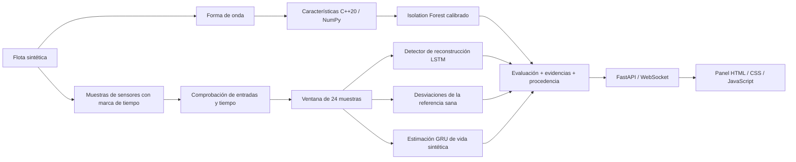

# ARGUS-NEURO

**Diagnóstico basado en evidencias para electrónica de potencia: procesamiento de señales en C++20, modelos de ML en Python y un panel de flota en tiempo real.**

[Русский](README.md) · [English](README.en.md) · [中文](README.zh.md) · [हिन्दी](README.hi.md) · **Español** · [Français](README.fr.md) · [Deutsch](README.de.md) · [Italiano](README.it.md)

[Contrato de diagnóstico (en inglés)](docs/RELIABILITY.md) · [Notas de evaluación (en inglés)](experiments/2026-09-30_reliability/notes.md)

ARGUS-NEURO es un prototipo de investigación funcional para convertidores marinos y unidades de distribución de energía de UAV. La aplicación actual ejecuta una **flota sintética** de seis activos. No recibe telemetría de equipos reales ni determina la vida útil remanente real.

## Funcionalidades implementadas

- **Pasaportes de decisión.** Cada evaluación incluye un ID derivado del contenido, una huella del paquete de modelos, evidencias de sensores y explicaciones. Identifican el contenido y los modelos evaluados; no son firmas digitales ni prueba de la causa de una avería.
- **Abstención explícita.** Lecturas ausentes o no finitas, formas de onda no válidas, discontinuidades temporales, modelos incompatibles e historial insuficiente producen estados explícitos en lugar de predicciones inventadas.
- **Diagnóstico respecto a referencias de sensores.** Las referencias sanas de entrenamiento, específicas de cada tipo de equipo, detectan desviaciones persistentes y alternas. Las referencias permanecen fijas durante la inferencia, de modo que un activo que se degrada no se aprende silenciosamente como normal.
- **Discrepancia entre detectores.** El panel muestra cuándo discrepan los detectores espectral, de reconstrucción y de referencia. Un solo detector positivo puede generar una alerta sin necesidad de votación por mayoría.
- **Características coherentes en C++ y NumPy.** Las 11 características estadísticas y espectrales usan un contrato común de FFT con relleno de ceros. La extensión pybind11 admite arreglos con paso e invertidos y libera el GIL tras copiar la entrada.
- **Monitorización consciente de la conexión.** El panel marca los flujos desconectados u obsoletos, conserva la última instantánea y reintenta la conexión. La telemetría generada en el navegador solo se inicia mediante una acción de demostración explícita y tiene una etiqueta de origen propia.
- **Interfaz en ocho idiomas.** Ruso (predeterminado), inglés, chino, hindi, español, francés, alemán e italiano; el idioma elegido se recuerda en el navegador.

Son decisiones de producto implementadas, no afirmaciones de novedad mundial ni de rendimiento industrial validado.

## Arquitectura



Los seis canales de sensores son `voltage_v`, `current_a`, `temperature_c`, `vibration_g`, `frequency_hz` y `load_factor`, en ese orden. El simulador admite sobrecalentamiento, desgaste de rodamientos, caída de tensión, deriva de frecuencia y degradación del aislamiento. La flota en vivo muestra cuatro escenarios de avería y dos activos sanos.

## Requisitos

El proyecto se ha probado en Ubuntu/Linux con CPython 3.12, GCC 13, CMake 3.28 y Node.js 22. Compilar la extensión nativa requiere un compilador C++20 y las cabeceras de desarrollo de Python. Python debe poder crear entornos virtuales. Node solo se necesita para las pruebas del panel, no para servir la aplicación.

Las versiones de las dependencias directas de Python están fijadas en [python/requirements.txt](python/requirements.txt); [python/requirements-dev.txt](python/requirements-dev.txt) instala además Ruff. No es un bloqueo completo de dependencias transitivas. El entrenamiento registra las versiones de sus principales bibliotecas numéricas en los informes del paquete.

## Primera instalación en Ubuntu

Ejecute desde la raíz del repositorio:

```bash
bash scripts/setup_env.sh
bash scripts/train_all.sh
bash scripts/run_dashboard.sh
```

1. La instalación crea `.venv` si hace falta, instala las dependencias y compila la extensión nativa.
2. El entrenamiento crea y valida un nuevo paquete de modelos antes de activarlo.
3. El lanzador usa el `.venv` del proyecto si existe e inicia Uvicorn en la dirección local.

Abra [http://127.0.0.1:8000](http://127.0.0.1:8000). Mantenga la terminal abierta; detenga el servidor con **Ctrl+C**. El lanzador cambia al directorio del repositorio, así que también funciona con una ruta absoluta desde otro directorio.

Para una copia ya configurada solo se necesita el lanzador:

```bash
bash scripts/run_dashboard.sh
```

No hace falta reentrenar en cada inicio. Tras actualizar desde los pesos de demostración históricos, ejecute el entrenamiento una vez: esos pesos carecen de los metadatos del paquete actual y el nuevo cargador no los acepta.

### Qué aparece tras el inicio

El servidor avanza la telemetría simulada aproximadamente cada **1,5 segundos más el tiempo de cálculo**. Cada muestra simulada representa **5 segundos** de funcionamiento del equipo. Los modelos necesitan 24 muestras consecutivas; partiendo de un búfer vacío, el calentamiento tarda unos 35–40 segundos en la máquina probada, según el tiempo de procesamiento.

La primera alarma de forma de onda puede aparecer antes de que termine el calentamiento. La salud por tendencia y la estimación de vida no están disponibles hasta que haya historial suficiente. Cada escenario se repite tras 400 muestras; en ese límite su historial se reinicia.

### Configuración

| Variable | Valor predeterminado | Propósito |
|---|---|---|
| `ARGUS_HOST` | `127.0.0.1` | Dirección en la que escucha Uvicorn |
| `ARGUS_PORT` | `8000` | Puerto HTTP y WebSocket |
| `ARGUS_ARTIFACTS_DIR` | Paquete local activo; si no, `artifacts/` | Selecciona explícitamente un directorio de modelos de confianza; se recomienda una ruta absoluta |
| `ARGUS_PYTHON` | `.venv/bin/python` del proyecto; si no, `python3` | Intérprete usado por los scripts de compilación, entrenamiento y ejecución; para sustituirlo, indique la ruta de un ejecutable. En la instalación inicial, el entorno virtual se crea por defecto con `python3`. |
| `OMP_NUM_THREADS`, `MKL_NUM_THREADS` | `1` en los lanzadores de entrenamiento y ejecución | Límites de hilos de CPU; los valores ya definidos se conservan |

Por ejemplo, para usar otro puerto local:

```bash
ARGUS_PORT=8001 bash scripts/run_dashboard.sh
```

La demostración no tiene autenticación ni aislamiento entre inquilinos. Cambiar la dirección de escucha no la hace apta para un despliegue público.

## Contrato de diagnóstico

| Estado de la evaluación | Significado |
|---|---|
| `warming_up` | Entradas válidas, pero hay menos de 24 muestras |
| `ready` | Se ejecutó la ruta de diagnóstico completa con una referencia de sensores adecuada |
| `invalid_data` | Los valores de los sensores, la forma de onda o el momento de medición no superaron la validación |
| `degraded` | Los modelos o los datos de referencia no están disponibles, o un modelo devolvió una salida no válida |

`ready` indica que se puede ejecutar, no una precisión demostrada en equipos reales. `is_anomaly` puede ser `null`, lo que significa desconocido y no normal. Durante el calentamiento, una alarma espectral ya puede ponerlo a `true`.

Una entrada de sensor no válida o una discontinuidad en las marcas de tiempo suministradas borra el historial del activo. La siguiente adquisición válida debe reconstruir la ventana. Las comprobaciones de tiempo requieren que quien llama pase `sample_time_s`; la demostración lo hace.

Cada evaluación incluye además:

- `data_quality`: problemas detectados y número de muestras recogidas/requeridas;
- `evidence`: las tres mayores desviaciones de sensores, las últimas lecturas y las medias de la referencia sana;
- `explanation` y `detector_disagreement`: motivos del diagnóstico y decisiones contradictorias de los detectores;
- `assessment_id` y `model_version`: huellas del contenido y del paquete;
- `source` y `rul_basis`: procedencia de las mediciones y de la estimación de vida.

El canal de referencia mide la desviación estandarizada RMS de la ventana respecto a los datos sanos de entrenamiento. Su umbral de 6 desviaciones estándar es una heurística explícita que requiere calibración en campo. Conserva las desviaciones alternas que se cancelarían en una media aritmética. Las evidencias de sensores no son un diagnóstico causal.

El índice de salud es una puntuación heurística de visualización, no una probabilidad de fallo. El panel muestra la vida restante como **porcentaje de un horizonte sintético**. El campo de la API `rul_hours` usa el horizonte registrado durante el entrenamiento y solo está disponible para fuentes simuladas; no es una estimación de horas de servicio reales. `rul_interval_normalized` se basa en los residuos de validación reservados y no tiene cobertura garantizada en el mundo real.

## API HTTP y WebSocket

| Punto de acceso | Comportamiento |
|---|---|
| `GET /` | Panel en ocho idiomas (RU por defecto, además EN, ZH, HI, ES, FR, DE, IT) |
| `GET /api/health` | Estado del generador, antigüedad de la instantánea, indicador de modelos cargados, número de clientes y error del generador |
| `GET /api/fleet` | Última instantánea completa de la flota; devuelve 503 antes de la primera instantánea |
| `WS /ws/telemetry` | Instantánea inicial si existe, seguida de actualizaciones de la flota |
| `GET /docs` | Documentación de la API HTTP generada por FastAPI |

`/api/health` devuelve 200 cuando el generador está en marcha y su última instantánea tiene como máximo 10 segundos; en otro caso devuelve 503. **Compruebe `model_backed` por separado:** un transporte sano puede seguir entregando evaluaciones con los modelos no disponibles. `/api/fleet` puede devolver una instantánea antigua tras un fallo del generador, por lo que los clientes deben revisar las marcas de tiempo y el estado en lugar de interpretar un HTTP 200 como telemetría reciente.

La inferencia se ejecuta en un hilo de trabajo con un único generador secuencial. Cada cliente WebSocket tiene su propio emisor, un tiempo límite de envío de tres segundos y una cola con como máximo una instantánea pendiente. Los clientes lentos pueden perder instantáneas intermedias: es un flujo de monitorización, no un registro de eventos duradero.

## Entrenamiento, artefactos y ONNX

Las trayectorias sintéticas completas se estratifican por tipo de activo y avería **antes** de escalar o crear ventanas solapadas. El autoencoder y el modelo de RUL tienen escaladores propios ajustados en ejecuciones de entrenamiento sanas. La calibración usa datos de validación; las métricas finales, datos de prueba independientes. El detector espectral usa igualmente semillas de forma de onda distintas para entrenamiento, calibración y prueba.

`bash scripts/train_all.sh` realiza los siguientes pasos:

1. Crea un directorio nuevo `artifacts/run-*`.
2. Entrena el detector espectral de referencia y el autoencoder LSTM, incluidas las referencias de sensores.
3. Entrena la GRU y registra su escala temporal sintética y su intervalo de residuos.
4. Exporta ambos modelos profundos a ONNX, valida su estructura y compara sus salidas con PyTorch.
5. Verifica la carga del nuevo paquete y actualiza `artifacts/active.json` de forma atómica.

Un entrenamiento o una validación fallidos dejan intacto el puntero activo anterior. Se conservan los pesos existentes y los directorios de ejecuciones fallidas. Reinicie el servidor en marcha para cargar un paquete recién activado. Un `ARGUS_ARTIFACTS_DIR` explícito tiene prioridad sobre el puntero activo; elimínelo para seguir los paquetes recién activados.

Los paquetes contienen los pesos de los modelos, ambos escaladores, las referencias sanas, metadatos, informes de entrenamiento, archivos ONNX y un informe de validación ONNX. El cargador comprueba la versión del esquema, el orden de los sensores, la longitud de ventana, el intervalo de muestreo, las sumas de comprobación y la compatibilidad de deserialización de sklearn. Use solo paquetes de confianza: joblib no es un formato de intercambio seguro para archivos de modelos no fiables.

La entrada ONNX fija es `(1, 24, 6)`. La verificación numérica usa **ONNX ReferenceEvaluator** con tres escalas de entrada. No están implementados un puente de inferencia ONNX Runtime en C++ ni la validación en el hardware embarcado de destino.

Git ignora los paquetes generados y `active.json`. Son resultados locales; una copia nueva necesita su propio entrenamiento o un paquete compatible suministrado explícitamente.

## Compilación y pruebas

Tras la instalación, ejecute desde la raíz del repositorio:

```bash
source .venv/bin/activate
bash scripts/build_cpp_core.sh
ctest --test-dir build --output-on-failure

# Extensión nativa y contratos de Python
PYTHONPATH="$PWD/python:$PWD/build/cpp_core" OMP_NUM_THREADS=1 MKL_NUM_THREADS=1 \
  python -m pytest python/tests -q

# Modo alternativo sin el directorio de compilación en la ruta de módulos de Python
PYTHONPATH="$PWD/python" OMP_NUM_THREADS=1 MKL_NUM_THREADS=1 \
  python -m pytest python/tests -q

ruff check python
ruff format --check python
node --check web/dashboard/app.js
node --test web/dashboard/tests/*.test.cjs
```

Las pruebas nativas siguen activas en la compilación Release. Las pruebas de Python cubren la paridad de características y casos límite, los modelos, la división independiente de ejecuciones, la procedencia y la abstención, y el comportamiento de WebSocket ante fallos. Las pruebas exclusivas de la extensión nativa se omiten si esta no está disponible. La comprobación del modo alternativo supone que `argus_core` no se ha instalado además en el entorno de Python.

[CI](.github/workflows/ci.yml) usa Python 3.12 y Node 22, compila la extensión, ejecuta ambos modos de Python, comprueba el formato y la lógica del panel y valida todo el flujo escalonado de entrenamiento y exportación.

### Evaluación registrada

El [experimento del 30-09-2026](experiments/2026-09-30_reliability/notes.md) registra:

| Comprobación o métrica | Resultado registrado |
|---|---|
| CTest nativo | 1 ejecutable de prueba superado |
| Python con extensión nativa | 65 superadas |
| Python con alternativa NumPy | 50 superadas, 15 exclusivas nativas omitidas |
| Lógica del panel | 3 pruebas de Node superadas |
| F1 / exhaustividad del autoencoder | 0,6690 / 0,5851 en ejecuciones sintéticas reservadas |
| MAE normalizado de RUL en prueba | 0,1875; referencia por mediana 0,2880 en el mismo conjunto |
| Diferencia absoluta máxima de ONNX | Inferior a 0,000001 en ambos modelos en las comprobaciones registradas |
| Demostración de 401 pasos | En el último paso del escenario se marcaron los cuatro activos averiados y ninguno de los dos sanos; el ciclo siguiente volvió al calentamiento |

Son resultados fechados, no resultados prometidos para otros entornos ni para equipos reales. La comprobación del último paso de la demostración no es un estudio de sensibilidad ni de falsas alarmas. Las métricas de ML originales y revisadas usan particiones distintas y no deben interpretarse como una mejora controlada de la precisión. La comprobación visual en el navegador no estaba disponible; la lógica del DOM y el transporte HTTP/WebSocket se verificaron por programa.

## Resolución de problemas

- **`GET /favicon.ico 404`:** no se incluye favicon. No afecta al diagnóstico ni a la telemetría.
- **Los valores de vida/salud muestran un guion:** revise el estado. Durante el calentamiento y con modelos no disponibles las predicciones se retienen a propósito.
- **`models_unavailable`:** ejecute el entrenamiento, verifique el paquete seleccionado y reinicie. Los pesos de demostración históricos de la raíz no cumplen el nuevo esquema.
- **Dirección ya en uso:** detenga con Ctrl+C el servidor que inició o elija otro `ARGUS_PORT`.
- **Flujo desconectado/obsoleto:** la interfaz conserva la última instantánea y reintenta. El botón de demostración en el navegador genera ilustraciones sin usar modelos entrenados; no reconecta la telemetría real.
- **Abrir `index.html` directamente:** la página puede ejecutar la demostración en el navegador, pero use la URL del servidor para obtener diagnósticos con modelos.
- **Discrepancia de dependencias o de serialización:** use el entorno virtual del proyecto y vuelva a entrenar con sus dependencias fijadas. No reutilice en silencio un paquete incompatible.

## Estructura del repositorio

| Ruta | Contenido |
|---|---|
| `cpp_core/` | Extracción de características, FFT radix-2, enlaces pybind11, pruebas nativas |
| `python/argus/simulator/` | Generación de telemetría sintética y formas de onda |
| `python/argus/features/`, `models/` | Interfaz nativa/NumPy y definiciones de modelos |
| `python/argus/training/` | División de ejecuciones, escaladores, entrenamiento, utilidades de reproducibilidad |
| `python/argus/inference/`, `python/argus/artifacts.py` | Evaluaciones y resolución del paquete activo |
| `python/argus/api/`, `python/argus/export/` | Servicio FastAPI y exportación ONNX verificada |
| `python/tests/` | Pruebas de regresión de Python |
| `web/dashboard/` | Consola multilingüe HTML/CSS/JS y pruebas de Node; sin sistema de compilación de frontend |
| `artifacts/` | Archivos de demostración históricos y paquetes generados localmente |
| `scripts/` | Configuración del entorno, compilación, entrenamiento escalonado, arranque local |
| `experiments/` | Configuraciones, métricas, instantáneas de cambios y notas de evaluación |
| `docs/RELIABILITY.md` | Decisiones de diagnóstico, comportamiento ante fallos y límites de despliegue |

## Límites actuales y próximos pasos

Los adaptadores de telemetría real, el historial persistente, la autenticación, el aislamiento entre inquilinos y un puente de inferencia ONNX Runtime en C++ siguen siendo trabajo futuro. Las prioridades para la validación en campo son la adquisición con marcas de tiempo, averías etiquetadas por ingeniería, activos físicos independientes para las pruebas, tasas de falsas alarmas aceptables y la medición del tiempo de anticipación. Antes de la operación industrial también se necesitan monitorización de la deriva y pruebas de larga duración de fallos de red y de dispositivos.

## Autor y licencia

Serguéyev Antón Valentínovich (Сергеев Антон Валентинович, Anton Valentinovich Sergeev). Licencia MIT; véase [LICENSE](LICENSE).
