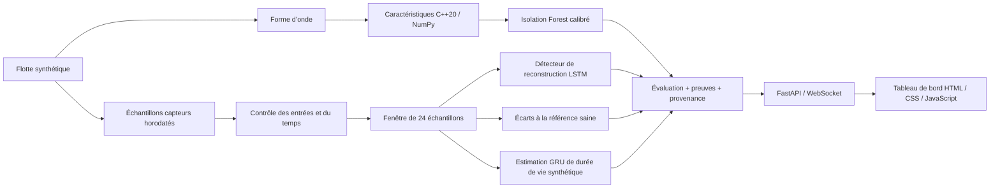

# ARGUS-NEURO

**Diagnostic fondé sur des preuves pour l’électronique de puissance : traitement du signal en C++20, modèles de ML en Python et tableau de bord de flotte en temps réel.**

[Русский](README.md) · [English](README.en.md) · [中文](README.zh.md) · [हिन्दी](README.hi.md) · [Español](README.es.md) · **Français** · [Deutsch](README.de.md) · [Italiano](README.it.md)

[Contrat de diagnostic (en anglais)](docs/RELIABILITY.md) · [Notes d’évaluation (en anglais)](experiments/2026-09-30_reliability/notes.md)

ARGUS-NEURO est un prototype de recherche fonctionnel pour les convertisseurs marins et les unités de distribution d’énergie de drones. L’application actuelle exploite une **flotte synthétique** de six actifs. Elle n’ingère pas de télémétrie d’équipements réels et n’établit pas de durée de vie résiduelle réelle.

## Fonctionnalités implémentées

- **Passeports de décision.** Chaque évaluation comprend un identifiant dérivé du contenu, une empreinte du lot de modèles, des preuves issues des capteurs et des explications. Ils identifient le contenu et les modèles évalués ; ce ne sont ni des signatures numériques ni la preuve de la cause d’une panne.
- **Abstention explicite.** Les mesures absentes ou non finies, les formes d’onde invalides, les discontinuités temporelles, les modèles incompatibles et un historique insuffisant produisent des statuts explicites au lieu de prédictions inventées.
- **Diagnostic par rapport aux références capteurs.** Des références saines d’entraînement propres à chaque type d’équipement détectent les écarts persistants et alternés. Les références restent figées pendant l’inférence, si bien qu’un actif qui se dégrade n’est pas appris silencieusement comme normal.
- **Désaccord entre détecteurs.** Le tableau de bord indique lorsque les détecteurs spectral, de reconstruction et par référence divergent. Un seul détecteur positif peut déclencher une alerte, sans vote majoritaire.
- **Caractéristiques cohérentes en natif et en NumPy.** Les 11 caractéristiques statistiques et spectrales utilisent un contrat FFT commun avec remplissage par zéros. L’extension pybind11 prend en charge les tableaux à pas et inversés et libère le GIL après la copie de l’entrée.
- **Surveillance tenant compte de la connexion.** Le tableau de bord signale les flux déconnectés ou obsolètes, conserve le dernier instantané et retente la connexion. La télémétrie générée dans le navigateur ne démarre que par une action de démonstration explicite et porte une étiquette de source distincte.
- **Interface en huit langues.** Russe (par défaut), anglais, chinois, hindi, espagnol, français, allemand et italien ; la langue choisie est mémorisée dans le navigateur.

Il s’agit de choix produit implémentés, et non de revendications de nouveauté mondiale ou de performances industrielles validées.

## Architecture



Les six canaux capteurs sont `voltage_v`, `current_a`, `temperature_c`, `vibration_g`, `frequency_hz` et `load_factor`, dans cet ordre. Le simulateur prend en charge la surchauffe, l’usure des roulements, le creux de tension, la dérive de fréquence et la dégradation de l’isolation. La flotte en direct présente quatre scénarios de panne et deux actifs sains.

## Prérequis

Le projet a été éprouvé sous Ubuntu/Linux avec CPython 3.12, GCC 13, CMake 3.28 et Node.js 22. La compilation de l’extension native nécessite un compilateur C++20 et les en-têtes de développement Python. Python doit pouvoir créer des environnements virtuels. Node n’est nécessaire que pour les tests du tableau de bord, pas pour servir l’application.

Les versions des dépendances Python directes sont figées dans [python/requirements.txt](python/requirements.txt) ; [python/requirements-dev.txt](python/requirements-dev.txt) installe en plus Ruff. Ce n’est pas un verrouillage complet des dépendances transitives. L’entraînement enregistre les versions de ses principales bibliothèques numériques dans les rapports du lot.

## Première installation sous Ubuntu

Exécutez depuis la racine du dépôt :

```bash
bash scripts/setup_env.sh
bash scripts/train_all.sh
bash scripts/run_dashboard.sh
```

1. L’installation crée `.venv` si nécessaire, installe les dépendances et compile l’extension native.
2. L’entraînement crée et valide un nouveau lot de modèles avant de l’activer.
3. Le lanceur utilise le `.venv` du projet s’il existe et démarre Uvicorn sur l’adresse locale.

Ouvrez [http://127.0.0.1:8000](http://127.0.0.1:8000). Laissez le terminal ouvert ; arrêtez le serveur avec **Ctrl+C**. Le lanceur se place dans le répertoire du dépôt, si bien qu’un chemin absolu fonctionne aussi depuis un autre répertoire.

Pour une copie déjà configurée, seul le lanceur est nécessaire :

```bash
bash scripts/run_dashboard.sh
```

Inutile de réentraîner à chaque démarrage. Après une mise à jour depuis les poids de démonstration historiques, lancez l’entraînement une fois : ces poids n’ont pas les métadonnées du lot actuel et le nouveau chargeur les refuse.

### Ce qui apparaît après le démarrage

Le serveur fait avancer la télémétrie simulée environ toutes les **1,5 seconde plus le temps de calcul**. Chaque échantillon simulé représente **5 secondes** de fonctionnement de l’équipement. Les modèles ont besoin de 24 échantillons consécutifs ; à partir d’un tampon vide, la mise en route prend environ 35 à 40 secondes sur la machine testée, selon le temps de traitement.

La première alarme de forme d’onde peut apparaître avant la fin de la mise en route. La santé par tendance et l’estimation de durée de vie restent indisponibles tant que l’historique est insuffisant. Chaque scénario se répète après 400 échantillons ; son historique est réinitialisé à cette limite.

### Configuration

| Variable | Valeur par défaut | Rôle |
|---|---|---|
| `ARGUS_HOST` | `127.0.0.1` | Adresse d’écoute d’Uvicorn |
| `ARGUS_PORT` | `8000` | Port HTTP et WebSocket |
| `ARGUS_ARTIFACTS_DIR` | Lot local actif, sinon `artifacts/` | Sélectionne explicitement un répertoire de modèles de confiance ; un chemin absolu est recommandé |
| `ARGUS_PYTHON` | `.venv/bin/python` du projet, sinon `python3` | Interpréteur utilisé par les scripts de compilation, d’entraînement et d’exécution ; pour le remplacer, indiquez le chemin d’un exécutable. Lors de l’installation initiale, l’environnement virtuel est créé par défaut avec `python3`. |
| `OMP_NUM_THREADS`, `MKL_NUM_THREADS` | `1` dans les lanceurs d’entraînement et d’exécution | Limites de threads CPU ; les valeurs existantes sont conservées |

Par exemple, pour utiliser un autre port local :

```bash
ARGUS_PORT=8001 bash scripts/run_dashboard.sh
```

La démonstration n’a ni authentification ni isolation entre locataires. Changer l’adresse d’écoute ne la rend pas adaptée à un déploiement public.

## Contrat de diagnostic

| Statut de l’évaluation | Signification |
|---|---|
| `warming_up` | Entrées valides, mais moins de 24 échantillons disponibles |
| `ready` | Le chemin de diagnostic complet a été exécuté avec une référence capteurs correspondante |
| `invalid_data` | Les valeurs des capteurs, la forme d’onde ou l’horodatage des mesures n’ont pas passé la validation |
| `degraded` | Les modèles ou les données de référence sont indisponibles, ou un modèle a renvoyé une sortie invalide |

`ready` décrit la capacité d’exécution, pas une précision prouvée sur un équipement réel. `is_anomaly` peut valoir `null`, ce qui signifie inconnu et non normal. Pendant la mise en route, une alarme spectrale peut déjà le mettre à `true`.

Une entrée capteur invalide ou une discontinuité dans les horodatages fournis efface l’historique de l’actif. L’acquisition valide suivante doit reconstruire la fenêtre. Les contrôles d’horodatage exigent que l’appelant transmette `sample_time_s` ; la démonstration le fait.

Chaque évaluation comprend également :

- `data_quality` : problèmes détectés et nombre d’échantillons collectés/requis ;
- `evidence` : les trois plus grands écarts capteurs, les dernières mesures et les moyennes de la référence saine ;
- `explanation` et `detector_disagreement` : motifs du diagnostic et décisions contradictoires des détecteurs ;
- `assessment_id` et `model_version` : empreintes du contenu et du lot ;
- `source` et `rul_basis` : provenance des mesures et de l’estimation de durée de vie.

Le canal de référence mesure l’écart standardisé RMS de la fenêtre par rapport aux données d’entraînement saines. Son seuil de 6 écarts-types est une heuristique explicite nécessitant un étalonnage sur le terrain. Il préserve les écarts alternés qui s’annuleraient dans une moyenne arithmétique. Les preuves capteurs ne constituent pas un diagnostic causal.

L’indice de santé est un score heuristique d’affichage, pas une probabilité de défaillance. Le tableau de bord affiche la durée de vie restante en **pourcentage d’un horizon synthétique**. Le champ d’API `rul_hours` utilise l’horizon enregistré pendant l’entraînement et n’est disponible que pour les sources simulées ; ce n’est pas une estimation des heures de service réelles. `rul_interval_normalized` repose sur les résidus de validation mis de côté et n’offre aucune couverture garantie en conditions réelles.

## API HTTP et WebSocket

| Point d’accès | Comportement |
|---|---|
| `GET /` | Tableau de bord en huit langues (RU par défaut, ainsi que EN, ZH, HI, ES, FR, DE, IT) |
| `GET /api/health` | État du générateur, âge de l’instantané, indicateur de modèles chargés, nombre de clients et erreur du générateur |
| `GET /api/fleet` | Dernier instantané complet de la flotte ; renvoie 503 avant le premier instantané |
| `WS /ws/telemetry` | Instantané initial s’il existe, puis mises à jour de la flotte |
| `GET /docs` | Documentation de l’API HTTP générée par FastAPI |

`/api/health` renvoie 200 lorsque le générateur fonctionne et que son dernier instantané date d’au plus 10 secondes ; sinon il renvoie 503. **Vérifiez `model_backed` séparément :** un transport sain peut encore livrer des évaluations alors que les modèles sont indisponibles. `/api/fleet` peut renvoyer un ancien instantané après une défaillance du générateur ; les clients doivent donc examiner les horodatages et l’état plutôt que d’interpréter un HTTP 200 comme une télémétrie récente.

L’inférence s’exécute dans un thread de travail avec un seul générateur séquentiel. Chaque client WebSocket dispose de son propre émetteur, d’un délai d’envoi de trois secondes et d’une file contenant au plus un instantané en attente. Les clients lents peuvent perdre des instantanés intermédiaires : il s’agit d’un flux de surveillance, pas d’un journal d’événements durable.

## Entraînement, artefacts et ONNX

Les trajectoires synthétiques complètes sont stratifiées par type d’actif et par panne **avant** la mise à l’échelle ou la création de fenêtres chevauchantes. L’autoencodeur et le modèle de RUL ont chacun leur normaliseur, ajusté sur des exécutions d’entraînement saines. L’étalonnage utilise les données de validation ; les métriques finales, des données de test indépendantes. Le détecteur spectral utilise de même des graines de forme d’onde distinctes pour l’entraînement, l’étalonnage et le test.

`bash scripts/train_all.sh` effectue les étapes suivantes :

1. Crée un nouveau répertoire `artifacts/run-*`.
2. Entraîne le détecteur spectral de référence et l’autoencodeur LSTM, y compris les références capteurs.
3. Entraîne le GRU et enregistre son échelle de temps synthétique et son intervalle de résidus.
4. Exporte les deux modèles profonds en ONNX, valide leur structure et compare leurs sorties à PyTorch.
5. Vérifie le chargement du nouveau lot et met à jour `artifacts/active.json` de façon atomique.

Un entraînement ou une validation en échec laisse intact le pointeur actif précédent. Les poids existants et les répertoires des exécutions échouées sont conservés. Redémarrez le serveur en cours d’exécution pour charger un lot nouvellement activé. Un `ARGUS_ARTIFACTS_DIR` explicite a priorité sur le pointeur actif ; supprimez-le pour suivre les lots nouvellement activés.

Les lots contiennent les poids des modèles, les deux normaliseurs, les références saines, des métadonnées, les rapports d’entraînement, les fichiers ONNX et un rapport de validation ONNX. Le chargeur vérifie la version du schéma, l’ordre des capteurs, la longueur de fenêtre, l’intervalle d’échantillonnage, les sommes de contrôle et la compatibilité de désérialisation sklearn. N’utilisez que des lots de confiance : joblib n’est pas un format d’échange sûr pour des fichiers de modèles non fiables.

L’entrée ONNX fixe est `(1, 24, 6)`. La vérification numérique utilise **ONNX ReferenceEvaluator** à trois échelles d’entrée. Un pont d’inférence ONNX Runtime en C++ et la validation sur le matériel embarqué cible ne sont pas implémentés.

Les lots générés et `active.json` sont ignorés par Git. Ce sont des sorties locales ; une copie neuve nécessite son propre entraînement ou un lot compatible fourni explicitement.

## Compilation et tests

Après l’installation, exécutez depuis la racine du dépôt :

```bash
source .venv/bin/activate
bash scripts/build_cpp_core.sh
ctest --test-dir build --output-on-failure

# Extension native et contrats Python
PYTHONPATH="$PWD/python:$PWD/build/cpp_core" OMP_NUM_THREADS=1 MKL_NUM_THREADS=1 \
  python -m pytest python/tests -q

# Mode de repli sans le répertoire de compilation dans le chemin des modules Python
PYTHONPATH="$PWD/python" OMP_NUM_THREADS=1 MKL_NUM_THREADS=1 \
  python -m pytest python/tests -q

ruff check python
ruff format --check python
node --check web/dashboard/app.js
node --test web/dashboard/tests/*.test.cjs
```

Les tests natifs restent actifs en compilation Release. Les tests Python couvrent la parité des caractéristiques et les cas limites, les modèles, le découpage indépendant des exécutions, la provenance et l’abstention, ainsi que le comportement WebSocket en cas de défaillance. Les tests propres à l’extension native sont ignorés lorsqu’elle est indisponible. La vérification du mode de repli suppose que `argus_core` n’a pas aussi été installé dans l’environnement Python.

La [CI](.github/workflows/ci.yml) utilise Python 3.12 et Node 22, compile l’extension, exécute les deux modes Python, vérifie la mise en forme et la logique du tableau de bord et valide l’ensemble du processus échelonné d’entraînement et d’export.

### Évaluation enregistrée

L’[expérience du 30/09/2026](experiments/2026-09-30_reliability/notes.md) enregistre :

| Vérification ou métrique | Résultat enregistré |
|---|---|
| CTest natif | 1 exécutable de test réussi |
| Python avec extension native | 65 réussis |
| Python avec repli NumPy | 50 réussis, 15 tests natifs ignorés |
| Logique du tableau de bord | 3 tests Node réussis |
| F1 / rappel de l’autoencodeur | 0,6690 / 0,5851 sur des exécutions synthétiques mises de côté |
| MAE normalisée de RUL en test | 0,1875 ; référence par médiane 0,2880 sur le même jeu de test |
| Différence absolue maximale ONNX | Inférieure à 0,000001 pour les deux modèles dans les contrôles enregistrés |
| Démonstration de 401 pas | Au dernier pas du scénario, les quatre actifs en panne étaient signalés et les deux actifs sains ne l’étaient pas ; le cycle suivant est revenu à la mise en route |

Ce sont des résultats datés, pas des résultats promis pour d’autres environnements ou des équipements réels. Le contrôle du dernier pas de la démonstration n’est pas une étude de sensibilité ou de fausses alarmes. Les métriques de ML d’origine et révisées utilisent des partitions différentes et ne doivent pas être interprétées comme une amélioration contrôlée de la précision. La vérification visuelle dans le navigateur n’était pas disponible ; la logique du DOM et le transport HTTP/WebSocket ont été vérifiés par programme.

## Dépannage

- **`GET /favicon.ico 404` :** aucune favicon n’est fournie. Cela n’affecte ni le diagnostic ni la télémétrie.
- **Les valeurs de durée de vie/santé affichent un tiret :** consultez le statut. Pendant la mise en route et lorsque les modèles sont indisponibles, les prédictions sont volontairement retenues.
- **`models_unavailable` :** lancez l’entraînement, vérifiez le lot sélectionné et redémarrez. Les anciens poids de démonstration à la racine ne respectent pas le nouveau schéma.
- **Adresse déjà utilisée :** arrêtez avec Ctrl+C le serveur que vous avez lancé ou choisissez un autre `ARGUS_PORT`.
- **Flux déconnecté/obsolète :** l’interface conserve le dernier instantané et retente. Le bouton de démonstration dans le navigateur génère des illustrations sans modèles entraînés ; il ne reconnecte pas la télémétrie réelle.
- **Ouverture directe de `index.html` :** la page peut lancer la démonstration dans le navigateur, mais utilisez l’URL du serveur pour un diagnostic fondé sur les modèles.
- **Incompatibilité de dépendances ou de sérialisation :** utilisez l’environnement virtuel du projet et réentraînez avec ses dépendances figées. Ne réutilisez pas silencieusement un lot incompatible.

## Organisation du dépôt

| Chemin | Contenu |
|---|---|
| `cpp_core/` | Extraction de caractéristiques, FFT radix-2, liaisons pybind11, tests natifs |
| `python/argus/simulator/` | Génération de télémétrie synthétique et de formes d’onde |
| `python/argus/features/`, `models/` | Interface native/NumPy et définitions des modèles |
| `python/argus/training/` | Découpage des exécutions, normaliseurs, entraînement, outils de reproductibilité |
| `python/argus/inference/`, `python/argus/artifacts.py` | Évaluations et résolution du lot actif |
| `python/argus/api/`, `python/argus/export/` | Service FastAPI et export ONNX vérifié |
| `python/tests/` | Tests de régression Python |
| `web/dashboard/` | Console multilingue HTML/CSS/JS et tests Node ; aucun outil de build frontend |
| `artifacts/` | Fichiers de démonstration historiques et lots générés localement |
| `scripts/` | Configuration de l’environnement, compilation, entraînement échelonné, lancement local |
| `experiments/` | Configurations, métriques, instantanés des modifications et notes d’évaluation |
| `docs/RELIABILITY.md` | Décisions de diagnostic, comportement en cas de défaillance et limites de déploiement |

## Limites actuelles et prochaines étapes

Les adaptateurs de télémétrie réelle, l’historique persistant, l’authentification, l’isolation entre locataires et un pont d’inférence ONNX Runtime en C++ restent des travaux à venir. Les priorités de la validation sur le terrain sont l’acquisition horodatée, des pannes étiquetées par l’ingénierie, des actifs physiques indépendants pour les tests, des taux de fausses alarmes acceptables et la mesure du délai d’alerte. Une surveillance de la dérive et des essais de longue durée sur les défaillances réseau et matérielles sont également nécessaires avant une exploitation industrielle.

## Auteur et licence

Sergueïev Anton Valentinovitch (Сергеев Антон Валентинович, Anton Valentinovich Sergeev). Sous licence MIT ; voir [LICENSE](LICENSE).
