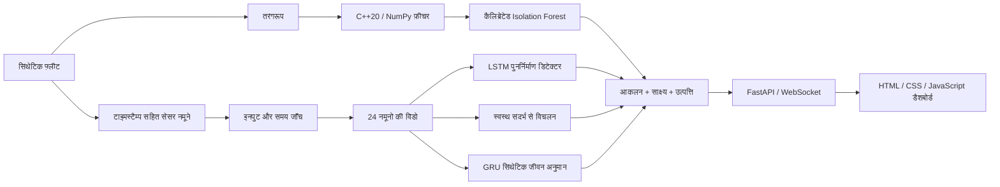

# ARGUS-NEURO

**पावर इलेक्ट्रॉनिक्स के लिए साक्ष्य-आधारित निदान: C++20 सिग्नल प्रोसेसिंग, Python ML मॉडल और लाइव फ़्लीट डैशबोर्ड।**

[Русский](README.md) · [English](README.en.md) · [中文](README.zh.md) · **हिन्दी** · [Español](README.es.md) · [Français](README.fr.md) · [Deutsch](README.de.md) · [Italiano](README.it.md)

[निदान अनुबंध (अंग्रेज़ी)](docs/RELIABILITY.md) · [मूल्यांकन नोट्स (अंग्रेज़ी)](experiments/2026-09-30_reliability/notes.md)

ARGUS-NEURO समुद्री कन्वर्टरों और UAV पावर-डिस्ट्रीब्यूशन इकाइयों के लिए एक कार्यशील शोध प्रोटोटाइप है। वर्तमान एप्लिकेशन छह परिसंपत्तियों वाला एक **सिंथेटिक फ़्लीट** चलाता है। यह वास्तविक उपकरणों की टेलीमेट्री ग्रहण नहीं करता और वास्तविक शेष उपयोगी जीवन निर्धारित नहीं करता।

## लागू की गई क्षमताएँ

- **निर्णय पासपोर्ट।** प्रत्येक आकलन में सामग्री से निकाला गया ID, मॉडल-बंडल फ़िंगरप्रिंट, सेंसर साक्ष्य और स्पष्टीकरण होते हैं। ये आकलित सामग्री और मॉडलों की पहचान करते हैं; ये डिजिटल हस्ताक्षर या दोष के कारण का प्रमाण नहीं हैं।
- **स्पष्ट रूप से पूर्वानुमान से इनकार।** अनुपस्थित या अपरिमित रीडिंग, अमान्य तरंगरूप, समय में विच्छेद, असंगत मॉडल और अपर्याप्त इतिहास गढ़े हुए पूर्वानुमानों के बजाय स्पष्ट स्थितियाँ देते हैं।
- **सेंसर-संदर्भ आधारित निदान।** उपकरण-विशिष्ट स्वस्थ प्रशिक्षण संदर्भ स्थायी और प्रत्यावर्ती विचलनों का पता लगाते हैं। इन्फ़रेंस के दौरान संदर्भ स्थिर रहते हैं, इसलिए क्षीण होती परिसंपत्ति चुपचाप "सामान्य" नहीं मान ली जाती।
- **डिटेक्टरों की असहमति।** डैशबोर्ड दिखाता है कि कब स्पेक्ट्रल, पुनर्निर्माण और संदर्भ-आधारित डिटेक्टर असहमत हैं। कोई एक सकारात्मक डिटेक्टर बहुमत मतदान के बिना भी अलर्ट उठा सकता है।
- **नेटिव और NumPy में एकसमान फ़ीचर।** 11 सांख्यिकीय/स्पेक्ट्रल फ़ीचर शून्य-पैडेड FFT के साझा अनुबंध का उपयोग करते हैं। pybind11 एक्सटेंशन स्ट्राइडेड/उलटे ऐरे का समर्थन करता है और इनपुट की प्रतिलिपि बनाने के बाद GIL मुक्त कर देता है।
- **कनेक्शन-सजग निगरानी।** डैशबोर्ड डिस्कनेक्ट या पुराने फ़ीड को चिह्नित करता है, अंतिम स्नैपशॉट बनाए रखता है और कनेक्शन का पुनः प्रयास करता है। ब्राउज़र में बनी टेलीमेट्री केवल स्पष्ट डेमो कार्रवाई से शुरू होती है और उसका स्रोत लेबल अलग होता है।
- **आठ भाषाओं में इंटरफ़ेस।** रूसी (डिफ़ॉल्ट), अंग्रेज़ी, चीनी, हिन्दी, स्पेनिश, फ़्रेंच, जर्मन और इतालवी; चुनी गई भाषा ब्राउज़र में याद रखी जाती है।

ये लागू किए गए उत्पाद निर्णय हैं, न कि विश्वव्यापी नवीनता या प्रमाणित औद्योगिक प्रदर्शन के दावे।

## आर्किटेक्चर



छह सेंसर चैनल इसी क्रम में हैं: `voltage_v`, `current_a`, `temperature_c`, `vibration_g`, `frequency_hz` और `load_factor`। सिम्युलेटर अधिक गर्मी, बेयरिंग घिसाव, वोल्टेज गिरावट, आवृत्ति विचलन और इन्सुलेशन क्षरण का समर्थन करता है। लाइव फ़्लीट चार दोष परिदृश्य और दो स्वस्थ परिसंपत्तियाँ दिखाता है।

## आवश्यकताएँ

परियोजना को Ubuntu/Linux पर CPython 3.12, GCC 13, CMake 3.28 और Node.js 22 के साथ परखा गया है। नेटिव एक्सटेंशन बनाने के लिए C++20 कंपाइलर और Python डेवलपमेंट हेडर आवश्यक हैं। Python को वर्चुअल एनवायरनमेंट बनाने में सक्षम होना चाहिए। Node केवल डैशबोर्ड परीक्षणों के लिए आवश्यक है, एप्लिकेशन चलाने के लिए नहीं।

प्रत्यक्ष Python निर्भरताओं के संस्करण [python/requirements.txt](python/requirements.txt) में तय हैं; [python/requirements-dev.txt](python/requirements-dev.txt) अतिरिक्त रूप से Ruff इंस्टॉल करता है। यह सभी अप्रत्यक्ष निर्भरताओं का पूर्ण लॉक नहीं है। प्रशिक्षण अपनी मुख्य संख्यात्मक लाइब्रेरियों के संस्करण बंडल रिपोर्टों में दर्ज करता है।

## Ubuntu पर पहली बार सेटअप

रिपॉज़िटरी के मूल फ़ोल्डर से चलाएँ:

```bash
bash scripts/setup_env.sh
bash scripts/train_all.sh
bash scripts/run_dashboard.sh
```

1. सेटअप आवश्यकता होने पर `.venv` बनाता है, निर्भरताएँ इंस्टॉल करता है और नेटिव एक्सटेंशन बनाता है।
2. प्रशिक्षण एक नया मॉडल बंडल बनाता और सत्यापित करता है, उसके बाद ही उसे सक्रिय करता है।
3. लॉन्चर उपलब्ध होने पर परियोजना का `.venv` उपयोग करता है और लूपबैक पते पर Uvicorn शुरू करता है।

[http://127.0.0.1:8000](http://127.0.0.1:8000) खोलें। टर्मिनल खुला रखें; सर्वर को **Ctrl+C** से रोकें। लॉन्चर स्वयं रिपॉज़िटरी फ़ोल्डर में चला जाता है, इसलिए किसी अन्य फ़ोल्डर से पूर्ण पथ द्वारा भी चलाया जा सकता है।

पहले से कॉन्फ़िगर की गई प्रति के लिए केवल लॉन्चर चाहिए:

```bash
bash scripts/run_dashboard.sh
```

हर बार शुरू करने पर दोबारा प्रशिक्षण आवश्यक नहीं है। पुराने डेमो वेट्स से अपडेट करने के बाद एक बार प्रशिक्षण चलाएँ: उन वेट्स में वर्तमान बंडल मेटाडेटा नहीं है और नया लोडर उन्हें स्वीकार नहीं करता।

### शुरू होने के बाद क्या दिखता है

सर्वर सिम्युलेटेड टेलीमेट्री को लगभग हर **1.5 सेकंड और गणना समय** में आगे बढ़ाता है। प्रत्येक सिम्युलेटेड नमूना उपकरण के **5 सेकंड** को दर्शाता है। मॉडलों को 24 लगातार नमूने चाहिए; खाली बफ़र से शुरू करने पर परखी गई मशीन पर वार्मअप में लगभग 35–40 सेकंड लगते हैं, जो प्रोसेसिंग समय पर निर्भर करता है।

पहला तरंगरूप अलार्म वार्मअप समाप्त होने से पहले भी दिख सकता है। पर्याप्त इतिहास होने तक रुझान स्वास्थ्य और जीवन अनुमान उपलब्ध नहीं रहते। प्रत्येक परिदृश्य 400 नमूनों के बाद दोहराया जाता है; उस सीमा पर उसका इतिहास रीसेट हो जाता है।

### कॉन्फ़िगरेशन

| वेरिएबल | डिफ़ॉल्ट | उद्देश्य |
|---|---|---|
| `ARGUS_HOST` | `127.0.0.1` | Uvicorn का बाइंड पता |
| `ARGUS_PORT` | `8000` | HTTP और WebSocket पोर्ट |
| `ARGUS_ARTIFACTS_DIR` | सक्रिय स्थानीय बंडल, अन्यथा `artifacts/` | विश्वसनीय मॉडल फ़ोल्डर स्पष्ट रूप से चुनें; पूर्ण पथ की अनुशंसा है |
| `ARGUS_PYTHON` | परियोजना का `.venv/bin/python`, अन्यथा `python3` | build/train/run स्क्रिप्टों द्वारा प्रयुक्त इंटरप्रेटर; बदलने के लिए निष्पादन योग्य फ़ाइल का पथ दें। प्रारंभिक सेटअप में वर्चुअल एनवायरनमेंट डिफ़ॉल्ट रूप से `python3` से बनता है। |
| `OMP_NUM_THREADS`, `MKL_NUM_THREADS` | train/run लॉन्चरों में `1` | CPU थ्रेड सीमाएँ; पहले से सेट मान सुरक्षित रहते हैं |

उदाहरण के लिए, दूसरा स्थानीय पोर्ट उपयोग करने हेतु:

```bash
ARGUS_PORT=8001 bash scripts/run_dashboard.sh
```

डेमो में प्रमाणीकरण या टेनेंट पृथक्करण नहीं है। बाइंड पता बदलने से यह सार्वजनिक परिनियोजन के योग्य नहीं बनता।

## निदान अनुबंध

| आकलन स्थिति | अर्थ |
|---|---|
| `warming_up` | इनपुट मान्य हैं, पर 24 से कम नमूने उपलब्ध हैं |
| `ready` | पूर्ण निदान प्रक्रिया मेल खाते सेंसर संदर्भ के साथ चली |
| `invalid_data` | सेंसर मान, तरंगरूप या माप का समय सत्यापन में विफल रहा |
| `degraded` | मॉडल/संदर्भ डेटा उपलब्ध नहीं हैं या किसी मॉडल ने अमान्य आउटपुट दिया |

`ready` निष्पादन की तत्परता बताता है, वास्तविक उपकरण पर सिद्ध सटीकता नहीं। `is_anomaly` का मान `null` हो सकता है, जिसका अर्थ "अज्ञात" है, "सामान्य" नहीं। वार्मअप के दौरान स्पेक्ट्रल अलार्म इसे पहले ही `true` कर सकता है।

अमान्य सेंसर इनपुट या दिए गए टाइमस्टैम्प में विच्छेद परिसंपत्ति का इतिहास साफ़ कर देता है। अगला मान्य माप विंडो को फिर से बनाना शुरू करता है। टाइमस्टैम्प जाँच के लिए कॉल करने वाले को `sample_time_s` भेजना होता है; डेमो ऐसा करता है।

प्रत्येक आकलन में यह भी शामिल है:

- `data_quality`: समस्याएँ और एकत्रित/आवश्यक नमूनों की संख्या;
- `evidence`: तीन सबसे बड़े सेंसर विचलन, नवीनतम रीडिंग और स्वस्थ संदर्भ के माध्य;
- `explanation` और `detector_disagreement`: निदान के कारण और परस्पर विरोधी डिटेक्टर निर्णय;
- `assessment_id` और `model_version`: सामग्री और बंडल के फ़िंगरप्रिंट;
- `source` और `rul_basis`: माप और जीवन अनुमान की उत्पत्ति।

संदर्भ चैनल स्वस्थ प्रशिक्षण डेटा से विंडो के RMS मानकीकृत विचलन को मापता है। 6 मानक विचलनों की सीमा एक स्पष्ट अनुमानी मान है जिसे क्षेत्र में कैलिब्रेट करना आवश्यक है। यह उन प्रत्यावर्ती विचलनों को सुरक्षित रखता है जो अंकगणितीय माध्य में एक-दूसरे को निरस्त कर देते। सेंसर साक्ष्य कारणात्मक निदान नहीं है।

स्वास्थ्य सूचकांक प्रदर्शन के लिए एक अनुमानी स्कोर है, विफलता की संभावना नहीं। डैशबोर्ड शेष जीवन को **सिंथेटिक समय-सीमा के प्रतिशत** के रूप में दिखाता है। API का `rul_hours` प्रशिक्षण के दौरान दर्ज समय-सीमा का उपयोग करता है और केवल सिमुलेशन स्रोतों के लिए उपलब्ध है; यह वास्तविक सेवा घंटों का अनुमान नहीं है। `rul_interval_normalized` अलग रखे गए सत्यापन अवशेषों पर आधारित है और वास्तविक दुनिया में कवरेज की गारंटी नहीं देता।

## HTTP और WebSocket API

| एंडपॉइंट | व्यवहार |
|---|---|
| `GET /` | आठ भाषाओं में डैशबोर्ड (डिफ़ॉल्ट RU, साथ ही EN, ZH, HI, ES, FR, DE, IT) |
| `GET /api/health` | जनरेटर की स्थिति, स्नैपशॉट की आयु, मॉडल लोड होने का संकेत, क्लाइंट संख्या और जनरेटर त्रुटि |
| `GET /api/fleet` | अंतिम पूर्ण फ़्लीट स्नैपशॉट; पहले स्नैपशॉट से पहले 503 लौटाता है |
| `WS /ws/telemetry` | उपलब्ध होने पर प्रारंभिक स्नैपशॉट, फिर फ़्लीट अपडेट |
| `GET /docs` | FastAPI द्वारा स्वतः बनाया गया HTTP API दस्तावेज़ |

जब जनरेटर चल रहा हो और उसका अंतिम स्नैपशॉट अधिकतम 10 सेकंड पुराना हो, तब `/api/health` 200 लौटाता है; अन्यथा 503। **`model_backed` को अलग से जाँचें:** स्वस्थ ट्रांसपोर्ट भी अनुपलब्ध मॉडलों के साथ आकलन भेज सकता है। जनरेटर विफल होने के बाद `/api/fleet` पुराना स्नैपशॉट लौटा सकता है, इसलिए क्लाइंट को HTTP 200 को ताज़ा टेलीमेट्री मानने के बजाय टाइमस्टैम्प और स्वास्थ्य स्थिति जाँचनी चाहिए।

इन्फ़रेंस एक वर्कर थ्रेड में एक क्रमिक जनरेटर के साथ चलता है। हर WebSocket क्लाइंट का अपना प्रेषक, तीन सेकंड का प्रेषण टाइमआउट और अधिकतम एक लंबित स्नैपशॉट वाली कतार होती है। धीमे क्लाइंटों के लिए बीच के स्नैपशॉट छूट सकते हैं: यह निगरानी फ़ीड है, स्थायी इवेंट लॉग नहीं।

## प्रशिक्षण, आर्टिफ़ैक्ट और ONNX

पूरे सिंथेटिक प्रक्षेप-पथों को स्केलिंग या ओवरलैपिंग विंडो बनाने से **पहले** परिसंपत्ति प्रकार और दोष के अनुसार स्तरीकृत किया जाता है। ऑटोएनकोडर और RUL मॉडलों के अलग-अलग स्केलर हैं जो स्वस्थ प्रशिक्षण रन पर फ़िट किए जाते हैं। कैलिब्रेशन सत्यापन डेटा का उपयोग करता है; अंतिम मेट्रिक्स स्वतंत्र परीक्षण डेटा का। स्पेक्ट्रल डिटेक्टर भी प्रशिक्षण, कैलिब्रेशन और परीक्षण के लिए अलग तरंगरूप सीड का उपयोग करता है।

`bash scripts/train_all.sh` निम्न चरण करता है:

1. एक नया `artifacts/run-*` फ़ोल्डर बनाता है।
2. स्पेक्ट्रल बेसलाइन और LSTM ऑटोएनकोडर को सेंसर संदर्भों सहित प्रशिक्षित करता है।
3. GRU को प्रशिक्षित करता है और उसका सिंथेटिक समय-पैमाना तथा अवशेष अंतराल दर्ज करता है।
4. दोनों डीप मॉडलों को ONNX में निर्यात करता है, उनकी संरचना सत्यापित करता है और आउटपुट की तुलना PyTorch से करता है।
5. नए बंडल के लोड होने की पुष्टि करता है और `artifacts/active.json` को परमाणु रूप से अपडेट करता है।

विफल प्रशिक्षण या सत्यापन पिछले सक्रिय पॉइंटर को अपरिवर्तित छोड़ देता है। मौजूदा वेट्स और विफल रन के फ़ोल्डर सुरक्षित रहते हैं। नया सक्रिय बंडल लोड करने के लिए चल रहे सर्वर को पुनः आरंभ करें। स्पष्ट रूप से सेट `ARGUS_ARTIFACTS_DIR` सक्रिय पॉइंटर पर प्राथमिकता रखता है; नए सक्रिय बंडलों का अनुसरण करने के लिए इसे हटा दें।

बंडल में मॉडल वेट्स, दोनों स्केलर, स्वस्थ संदर्भ, मेटाडेटा, प्रशिक्षण रिपोर्ट, ONNX फ़ाइलें और ONNX सत्यापन रिपोर्ट होती है। लोडर स्कीमा संस्करण, सेंसर क्रम, विंडो लंबाई, नमूना अंतराल, चेकसम और sklearn डिसीरियलाइज़ेशन संगतता की जाँच करता है। केवल विश्वसनीय बंडलों का उपयोग करें: अविश्वसनीय मॉडल फ़ाइलों के आदान-प्रदान के लिए joblib सुरक्षित प्रारूप नहीं है।

निश्चित ONNX इनपुट `(1, 24, 6)` है। संख्यात्मक सत्यापन तीन इनपुट पैमानों पर **ONNX ReferenceEvaluator** का उपयोग करता है। C++ ONNX Runtime इन्फ़रेंस ब्रिज और लक्षित एज हार्डवेयर पर सत्यापन लागू नहीं किए गए हैं।

बनाए गए बंडल और `active.json` को Git अनदेखा करता है। ये स्थानीय आउटपुट हैं; नई प्रति को अपना प्रशिक्षण रन या स्पष्ट रूप से दिया गया संगत बंडल चाहिए।

## बिल्ड और परीक्षण

सेटअप के बाद रिपॉज़िटरी के मूल फ़ोल्डर से चलाएँ:

```bash
source .venv/bin/activate
bash scripts/build_cpp_core.sh
ctest --test-dir build --output-on-failure

# नेटिव एक्सटेंशन और Python अनुबंध
PYTHONPATH="$PWD/python:$PWD/build/cpp_core" OMP_NUM_THREADS=1 MKL_NUM_THREADS=1 \
  python -m pytest python/tests -q

# Python मॉड्यूल पथ में build फ़ोल्डर के बिना वैकल्पिक मोड
PYTHONPATH="$PWD/python" OMP_NUM_THREADS=1 MKL_NUM_THREADS=1 \
  python -m pytest python/tests -q

ruff check python
ruff format --check python
node --check web/dashboard/app.js
node --test web/dashboard/tests/*.test.cjs
```

नेटिव परीक्षण Release बिल्ड में भी सक्रिय रहते हैं। Python परीक्षण फ़ीचर समानता और सीमांत मामलों, मॉडलों, स्वतंत्र रन विभाजन, उत्पत्ति और पूर्वानुमान से इनकार, तथा WebSocket विफलता व्यवहार को कवर करते हैं। केवल-नेटिव परीक्षण एक्सटेंशन अनुपलब्ध होने पर छोड़ दिए जाते हैं। वैकल्पिक मोड की जाँच मानती है कि `argus_core` Python एनवायरनमेंट में अलग से इंस्टॉल नहीं है।

[CI](.github/workflows/ci.yml) Python 3.12 और Node 22 का उपयोग करता है, एक्सटेंशन बनाता है, दोनों Python मोड चलाता है, फ़ॉर्मेटिंग/डैशबोर्ड तर्क जाँचता है और पूरी चरणबद्ध प्रशिक्षण/निर्यात प्रक्रिया को सत्यापित करता है।

### दर्ज किया गया मूल्यांकन

[2026-09-30 का प्रयोग](experiments/2026-09-30_reliability/notes.md) यह दर्ज करता है:

| जाँच या मेट्रिक | दर्ज परिणाम |
|---|---|
| नेटिव CTest | 1 परीक्षण प्रोग्राम सफल |
| नेटिव एक्सटेंशन के साथ Python | 65 सफल |
| NumPy वैकल्पिक मोड के साथ Python | 50 सफल, 15 केवल-नेटिव छोड़े गए |
| डैशबोर्ड तर्क | 3 Node परीक्षण सफल |
| ऑटोएनकोडर F1 / रिकॉल | अलग रखे गए सिंथेटिक रन पर 0.6690 / 0.5851 |
| RUL सामान्यीकृत परीक्षण MAE | 0.1875; उसी परीक्षण सेट पर माध्यिका बेसलाइन 0.2880 |
| ONNX अधिकतम निरपेक्ष अंतर | दर्ज समानता जाँचों में दोनों मॉडलों के लिए 0.000001 से कम |
| 401-चरण डेमो | परिदृश्य के अंतिम चरण पर चारों दोषपूर्ण परिसंपत्तियाँ चिह्नित और दोनों स्वस्थ परिसंपत्तियाँ अचिह्नित; अगला चक्र वार्मअप पर लौटा |

ये दिनांकित परिणाम हैं, अन्य परिवेशों या वास्तविक उपकरणों के लिए वादा किए गए परिणाम नहीं। डेमो के अंतिम चरण की जाँच संवेदनशीलता/झूठे अलार्म का अध्ययन नहीं है। मूल और संशोधित ML मेट्रिक्स अलग-अलग विभाजनों पर आधारित हैं और इन्हें नियंत्रित सटीकता सुधार नहीं समझना चाहिए। उस समय दृश्य ब्राउज़र जाँच उपलब्ध नहीं थी; DOM तर्क और HTTP/WebSocket ट्रांसपोर्ट को प्रोग्रामेटिक रूप से जाँचा गया।

## समस्या निवारण

- **`GET /favicon.ico 404`:** कोई फ़ेविकॉन नहीं दिया गया है। इसका निदान या टेलीमेट्री पर कोई प्रभाव नहीं है।
- **जीवन/स्वास्थ्य मान के स्थान पर डैश:** स्थिति देखें। वार्मअप और अनुपलब्ध मॉडलों की स्थिति में पूर्वानुमान जानबूझकर रोके जाते हैं।
- **`models_unavailable`:** प्रशिक्षण प्रक्रिया चलाएँ, चुने गए बंडल की जाँच करें और पुनः आरंभ करें। मूल फ़ोल्डर के पुराने डेमो वेट्स नई स्कीमा को पूरा नहीं करते।
- **पता पहले से उपयोग में है:** पहले शुरू किए सर्वर को Ctrl+C से रोकें या दूसरा `ARGUS_PORT` चुनें।
- **कनेक्शन टूटा/डेटा पुराना:** इंटरफ़ेस अंतिम स्नैपशॉट बनाए रखता है और पुनः प्रयास करता है। ब्राउज़र-डेमो बटन प्रशिक्षित मॉडलों के बिना उदाहरण बनाता है; यह वास्तविक टेलीमेट्री को पुनः कनेक्ट नहीं करता।
- **`index.html` को सीधे खोलना:** पृष्ठ ब्राउज़र डेमो चला सकता है, पर मॉडल-आधारित निदान के लिए सर्वर URL का उपयोग करें।
- **निर्भरता या सीरियलाइज़ेशन बेमेल:** परियोजना के वर्चुअल एनवायरनमेंट का उपयोग करें और तय निर्भरताओं के साथ पुनः प्रशिक्षण करें। असंगत बंडल का चुपचाप पुनः उपयोग न करें।

## रिपॉज़िटरी संरचना

| पथ | सामग्री |
|---|---|
| `cpp_core/` | फ़ीचर निष्कर्षण, radix-2 FFT, pybind11 बाइंडिंग, नेटिव परीक्षण |
| `python/argus/simulator/` | सिंथेटिक टेलीमेट्री और तरंगरूप निर्माण |
| `python/argus/features/`, `models/` | नेटिव/NumPy इंटरफ़ेस और मॉडल परिभाषाएँ |
| `python/argus/training/` | रन विभाजन, स्केलर, प्रशिक्षण, पुनरुत्पादनीयता सहायक |
| `python/argus/inference/`, `python/argus/artifacts.py` | आकलन और सक्रिय बंडल का चयन |
| `python/argus/api/`, `python/argus/export/` | FastAPI सेवा और सत्यापित ONNX निर्यात |
| `python/tests/` | Python प्रतिगमन परीक्षण |
| `web/dashboard/` | बहुभाषी HTML/CSS/JS कंसोल और Node परीक्षण; कोई फ़्रंटएंड बिल्ड सिस्टम नहीं |
| `artifacts/` | पुरानी डेमो फ़ाइलें और स्थानीय रूप से बने बंडल |
| `scripts/` | एनवायरनमेंट सेटअप, बिल्ड, चरणबद्ध प्रशिक्षण, स्थानीय लॉन्च |
| `experiments/` | कॉन्फ़िगरेशन, मेट्रिक्स, परिवर्तन स्नैपशॉट और मूल्यांकन नोट्स |
| `docs/RELIABILITY.md` | निदान निर्णय, विफलता व्यवहार और परिनियोजन सीमाएँ |

## वर्तमान सीमाएँ और अगले कदम

वास्तविक टेलीमेट्री एडेप्टर, स्थायी इतिहास, प्रमाणीकरण, टेनेंट पृथक्करण और C++ ONNX Runtime इन्फ़रेंस ब्रिज भविष्य के कार्य हैं। क्षेत्र सत्यापन की प्राथमिकताएँ हैं: टाइमस्टैम्प सहित डेटा संग्रह, इंजीनियरिंग द्वारा लेबल किए गए दोष, परीक्षण के लिए स्वतंत्र भौतिक परिसंपत्तियाँ, स्वीकार्य झूठे अलार्म दर और चेतावनी-समय का मापन। औद्योगिक संचालन से पहले ड्रिफ़्ट निगरानी और लंबी अवधि के नेटवर्क/उपकरण विफलता परीक्षण भी आवश्यक हैं।

## लेखक और लाइसेंस

सेर्गेयेव अंतोन वालेंतिनोविच (Сергеев Антон Валентинович, Anton Valentinovich Sergeev)। MIT लाइसेंस के अंतर्गत; देखें [LICENSE](LICENSE)।
