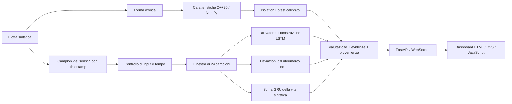

# ARGUS-NEURO

**Diagnostica basata su evidenze per l’elettronica di potenza: elaborazione del segnale in C++20, modelli di ML in Python e una dashboard della flotta in tempo reale.**

[Русский](README.md) · [English](README.en.md) · [中文](README.zh.md) · [हिन्दी](README.hi.md) · [Español](README.es.md) · [Français](README.fr.md) · [Deutsch](README.de.md) · **Italiano**

[Contratto diagnostico (in inglese)](docs/RELIABILITY.md) · [Note di valutazione (in inglese)](experiments/2026-09-30_reliability/notes.md)

ARGUS-NEURO è un prototipo di ricerca funzionante per convertitori marini e unità di distribuzione dell’energia di UAV. L’applicazione attuale gestisce una **flotta sintetica** di sei asset. Non acquisisce telemetria da apparecchiature reali e non determina la vita utile residua reale.

## Funzionalità implementate

- **Passaporti della decisione.** Ogni valutazione include un ID derivato dal contenuto, un’impronta del pacchetto di modelli, evidenze dai sensori e spiegazioni. Identificano il contenuto e i modelli valutati; non sono firme digitali né prove della causa di un guasto.
- **Astensione esplicita.** Letture mancanti o non finite, forme d’onda non valide, discontinuità temporali, modelli incompatibili e storico insufficiente producono stati espliciti invece di previsioni inventate.
- **Diagnostica rispetto ai riferimenti dei sensori.** Riferimenti sani di addestramento, specifici per tipo di apparecchiatura, rilevano deviazioni persistenti e alternate. I riferimenti restano fissi durante l’inferenza, così un asset che si degrada non viene appreso silenziosamente come normale.
- **Disaccordo tra rilevatori.** La dashboard mostra quando i rilevatori spettrale, di ricostruzione e basato sui riferimenti sono in disaccordo. Un solo rilevatore positivo può generare un allarme senza voto a maggioranza.
- **Caratteristiche coerenti tra codice nativo e NumPy.** Le 11 caratteristiche statistiche e spettrali usano un contratto FFT comune con riempimento di zeri. L’estensione pybind11 supporta array con passo e invertiti e rilascia il GIL dopo aver copiato l’input.
- **Monitoraggio consapevole della connessione.** La dashboard segnala i flussi disconnessi o obsoleti, conserva l’ultima istantanea e ritenta la connessione. La telemetria generata nel browser parte solo con un’azione dimostrativa esplicita e ha un’etichetta di origine separata.
- **Interfaccia in otto lingue.** Russo (predefinito), inglese, cinese, hindi, spagnolo, francese, tedesco e italiano; la lingua scelta viene ricordata nel browser.

Si tratta di scelte di prodotto implementate, non di affermazioni di novità mondiale o di prestazioni industriali convalidate.

## Architettura



I sei canali dei sensori sono `voltage_v`, `current_a`, `temperature_c`, `vibration_g`, `frequency_hz` e `load_factor`, in quest’ordine. Il simulatore supporta surriscaldamento, usura dei cuscinetti, abbassamento di tensione, deriva di frequenza e degrado dell’isolamento. La flotta dal vivo mostra quattro scenari di guasto e due asset sani.

## Requisiti

Il progetto è stato provato su Ubuntu/Linux con CPython 3.12, GCC 13, CMake 3.28 e Node.js 22. La compilazione dell’estensione nativa richiede un compilatore C++20 e gli header di sviluppo di Python. Python deve poter creare ambienti virtuali. Node serve solo per i test della dashboard, non per eseguire l’applicazione.

Le versioni delle dipendenze Python dirette sono fissate in [python/requirements.txt](python/requirements.txt); [python/requirements-dev.txt](python/requirements-dev.txt) installa in aggiunta Ruff. Non è un blocco completo delle dipendenze transitive. L’addestramento registra le versioni delle principali librerie numeriche nei report del pacchetto.

## Prima installazione su Ubuntu

Eseguire dalla radice del repository:

```bash
bash scripts/setup_env.sh
bash scripts/train_all.sh
bash scripts/run_dashboard.sh
```

1. L’installazione crea `.venv` se necessario, installa le dipendenze e compila l’estensione nativa.
2. L’addestramento crea e convalida un nuovo pacchetto di modelli prima di attivarlo.
3. Lo script di avvio usa il `.venv` del progetto, se presente, e avvia Uvicorn sull’indirizzo locale.

Aprite [http://127.0.0.1:8000](http://127.0.0.1:8000). Tenete aperto il terminale; arrestate il server con **Ctrl+C**. Lo script di avvio si sposta da solo nella directory del repository, quindi funziona anche con un percorso assoluto da un’altra directory.

Per una copia già configurata basta lo script di avvio:

```bash
bash scripts/run_dashboard.sh
```

Non serve riaddestrare a ogni avvio. Dopo l’aggiornamento dai pesi dimostrativi storici, eseguite l’addestramento una volta: quei pesi non hanno i metadati del pacchetto attuale e il nuovo caricatore non li accetta.

### Cosa appare dopo l’avvio

Il server fa avanzare la telemetria simulata circa ogni **1,5 secondi più il tempo di calcolo**. Ogni campione simulato rappresenta **5 secondi** di funzionamento dell’apparecchiatura. I modelli hanno bisogno di 24 campioni consecutivi; partendo da un buffer vuoto, il riscaldamento richiede circa 35–40 secondi sulla macchina provata, a seconda del tempo di elaborazione.

Il primo allarme sulla forma d’onda può comparire prima della fine del riscaldamento. La salute basata sul trend e la stima della vita restano non disponibili finché lo storico non è sufficiente. Ogni scenario si ripete dopo 400 campioni; a quel limite il suo storico viene azzerato.

### Configurazione

| Variabile | Valore predefinito | Scopo |
|---|---|---|
| `ARGUS_HOST` | `127.0.0.1` | Indirizzo di ascolto di Uvicorn |
| `ARGUS_PORT` | `8000` | Porta HTTP e WebSocket |
| `ARGUS_ARTIFACTS_DIR` | Pacchetto locale attivo, altrimenti `artifacts/` | Seleziona esplicitamente una directory di modelli attendibile; si consiglia un percorso assoluto |
| `ARGUS_PYTHON` | `.venv/bin/python` del progetto, altrimenti `python3` | Interprete usato dagli script di compilazione, addestramento e avvio; per sostituirlo indicate il percorso di un eseguibile. Nell’installazione iniziale l’ambiente virtuale viene creato di default con `python3`. |
| `OMP_NUM_THREADS`, `MKL_NUM_THREADS` | `1` negli script di addestramento e avvio | Limiti dei thread CPU; i valori già impostati vengono mantenuti |

Ad esempio, per usare un’altra porta locale:

```bash
ARGUS_PORT=8001 bash scripts/run_dashboard.sh
```

La demo non ha autenticazione né isolamento tra tenant. Cambiare l’indirizzo di ascolto non la rende adatta a un’installazione pubblica.

## Contratto diagnostico

| Stato della valutazione | Significato |
|---|---|
| `warming_up` | Input validi, ma sono disponibili meno di 24 campioni |
| `ready` | Il percorso diagnostico completo è stato eseguito con un riferimento dei sensori corrispondente |
| `invalid_data` | Valori dei sensori, forma d’onda o tempi di misura non hanno superato la convalida |
| `degraded` | Modelli o dati di riferimento non disponibili, oppure un modello ha restituito un output non valido |

`ready` descrive la prontezza all’esecuzione, non un’accuratezza dimostrata su apparecchiature reali. `is_anomaly` può essere `null`, che significa sconosciuto e non normale. Durante il riscaldamento un allarme spettrale può già impostarlo a `true`.

Un input di sensore non valido o una discontinuità nei timestamp forniti cancella lo storico dell’asset. L’acquisizione valida successiva deve ricostruire la finestra. I controlli sui timestamp richiedono che il chiamante passi `sample_time_s`; la demo lo fa.

Ogni valutazione include inoltre:

- `data_quality`: problemi rilevati e numero di campioni raccolti/richiesti;
- `evidence`: le tre maggiori deviazioni dei sensori, le ultime letture e le medie del riferimento sano;
- `explanation` e `detector_disagreement`: motivi della diagnosi e decisioni contrastanti dei rilevatori;
- `assessment_id` e `model_version`: impronte del contenuto e del pacchetto;
- `source` e `rul_basis`: provenienza delle misure e della stima della vita.

Il canale di riferimento misura la deviazione standardizzata RMS della finestra rispetto ai dati di addestramento sani. La sua soglia di 6 deviazioni standard è un’euristica esplicita che richiede una calibrazione sul campo. Conserva le deviazioni alternate che si annullerebbero in una media aritmetica. Le evidenze dei sensori non sono una diagnosi causale.

L’indice di salute è un punteggio euristico di visualizzazione, non una probabilità di guasto. La dashboard mostra la vita residua come **percentuale di un orizzonte sintetico**. Il campo API `rul_hours` usa l’orizzonte registrato durante l’addestramento ed è disponibile solo per le sorgenti simulate; non è una stima delle ore di servizio reali. `rul_interval_normalized` si basa sui residui di convalida tenuti da parte e non ha copertura garantita nel mondo reale.

## API HTTP e WebSocket

| Endpoint | Comportamento |
|---|---|
| `GET /` | Dashboard in otto lingue (RU predefinito, oltre a EN, ZH, HI, ES, FR, DE, IT) |
| `GET /api/health` | Stato del generatore, età dell’istantanea, indicatore dei modelli caricati, numero di client ed errore del generatore |
| `GET /api/fleet` | Ultima istantanea completa della flotta; restituisce 503 prima della prima istantanea |
| `WS /ws/telemetry` | Istantanea iniziale se disponibile, seguita dagli aggiornamenti della flotta |
| `GET /docs` | Documentazione dell’API HTTP generata da FastAPI |

`/api/health` restituisce 200 quando il generatore è in esecuzione e la sua ultima istantanea ha al massimo 10 secondi; altrimenti restituisce 503. **Controllate `model_backed` separatamente:** un trasporto sano può comunque consegnare valutazioni con i modelli non disponibili. Dopo un guasto del generatore `/api/fleet` può restituire un’istantanea vecchia, perciò i client devono controllare timestamp e stato invece di interpretare HTTP 200 come telemetria aggiornata.

L’inferenza viene eseguita in un thread di lavoro con un unico generatore sequenziale. Ogni client WebSocket ha un proprio mittente, un timeout di invio di tre secondi e una coda con al massimo un’istantanea in attesa. I client lenti possono perdere istantanee intermedie: è un flusso di monitoraggio, non un registro di eventi persistente.

## Addestramento, artefatti e ONNX

Le traiettorie sintetiche complete vengono stratificate per tipo di asset e guasto **prima** della normalizzazione e della creazione di finestre sovrapposte. L’autoencoder e il modello RUL hanno normalizzatori propri, adattati su esecuzioni di addestramento sane. La calibrazione usa i dati di convalida; le metriche finali, dati di test indipendenti. Il rilevatore spettrale usa analogamente seed di forma d’onda distinti per addestramento, calibrazione e test.

`bash scripts/train_all.sh` esegue i seguenti passi:

1. Crea una nuova directory `artifacts/run-*`.
2. Addestra il rilevatore spettrale di base e l’autoencoder LSTM, inclusi i riferimenti dei sensori.
3. Addestra la GRU e registra la sua scala temporale sintetica e l’intervallo dei residui.
4. Esporta entrambi i modelli profondi in ONNX, ne verifica la struttura e confronta gli output con PyTorch.
5. Verifica il caricamento del nuovo pacchetto e aggiorna `artifacts/active.json` in modo atomico.

Un addestramento o una convalida non riusciti lasciano intatto il puntatore attivo precedente. I pesi esistenti e le directory delle esecuzioni fallite vengono conservati. Riavviate il server in esecuzione per caricare un pacchetto appena attivato. Un `ARGUS_ARTIFACTS_DIR` esplicito ha la precedenza sul puntatore attivo; rimuovetelo per seguire i pacchetti appena attivati.

I pacchetti contengono i pesi dei modelli, entrambi i normalizzatori, i riferimenti sani, i metadati, i report di addestramento, i file ONNX e un report di convalida ONNX. Il caricatore verifica versione dello schema, ordine dei sensori, lunghezza della finestra, intervallo di campionamento, checksum e compatibilità della deserializzazione sklearn. Usate solo pacchetti attendibili: joblib non è un formato di scambio sicuro per file di modelli non attendibili.

L’input ONNX fisso è `(1, 24, 6)`. La verifica numerica usa **ONNX ReferenceEvaluator** su tre scale di input. Un ponte di inferenza ONNX Runtime in C++ e la convalida sull’hardware di bordo di destinazione non sono implementati.

I pacchetti generati e `active.json` sono ignorati da Git. Sono risultati locali; una copia nuova richiede un proprio addestramento o un pacchetto compatibile fornito esplicitamente.

## Compilazione e test

Dopo l’installazione, eseguire dalla radice del repository:

```bash
source .venv/bin/activate
bash scripts/build_cpp_core.sh
ctest --test-dir build --output-on-failure

# Estensione nativa e contratti Python
PYTHONPATH="$PWD/python:$PWD/build/cpp_core" OMP_NUM_THREADS=1 MKL_NUM_THREADS=1 \
  python -m pytest python/tests -q

# Modalità di ripiego senza la directory di build nel percorso dei moduli Python
PYTHONPATH="$PWD/python" OMP_NUM_THREADS=1 MKL_NUM_THREADS=1 \
  python -m pytest python/tests -q

ruff check python
ruff format --check python
node --check web/dashboard/app.js
node --test web/dashboard/tests/*.test.cjs
```

I test nativi restano attivi nella build Release. I test Python coprono la parità delle caratteristiche e i casi limite, i modelli, la suddivisione indipendente delle esecuzioni, la provenienza e l’astensione, e il comportamento WebSocket in caso di guasto. I test solo nativi vengono saltati se l’estensione non è disponibile. Il controllo della modalità di ripiego presuppone che `argus_core` non sia installato anche nell’ambiente Python.

La [CI](.github/workflows/ci.yml) usa Python 3.12 e Node 22, compila l’estensione, esegue entrambe le modalità Python, controlla formattazione e logica della dashboard e convalida l’intero flusso a fasi di addestramento ed esportazione.

### Valutazione registrata

L’[esperimento del 30/09/2026](experiments/2026-09-30_reliability/notes.md) registra:

| Controllo o metrica | Risultato registrato |
|---|---|
| CTest nativo | 1 eseguibile di test superato |
| Python con estensione nativa | 65 superati |
| Python con ripiego NumPy | 50 superati, 15 test solo nativi saltati |
| Logica della dashboard | 3 test Node superati |
| F1 / recall dell’autoencoder | 0,6690 / 0,5851 su esecuzioni sintetiche tenute da parte |
| MAE normalizzato RUL sul test | 0,1875; baseline mediana 0,2880 sullo stesso set di test |
| Differenza assoluta massima ONNX | Inferiore a 0,000001 per entrambi i modelli nei controlli registrati |
| Demo di 401 passi | All’ultimo passo dello scenario tutti e quattro gli asset guasti erano segnalati e i due sani no; il ciclo successivo è tornato al riscaldamento |

Sono risultati datati, non risultati promessi per altri ambienti o per apparecchiature reali. Il controllo dell’ultimo passo della demo non è uno studio di sensibilità o di falsi allarmi. Le metriche di ML originali e riviste usano partizioni diverse e non vanno interpretate come un miglioramento controllato dell’accuratezza. Il controllo visivo nel browser non era disponibile; la logica del DOM e il trasporto HTTP/WebSocket sono stati verificati in modo programmatico.

## Risoluzione dei problemi

- **`GET /favicon.ico 404`:** non viene fornita alcuna favicon. Non influisce su diagnostica e telemetria.
- **I valori di vita/salute mostrano un trattino:** controllate lo stato. Durante il riscaldamento e con modelli non disponibili le previsioni vengono trattenute di proposito.
- **`models_unavailable`:** eseguite l’addestramento, verificate il pacchetto selezionato e riavviate. I pesi dimostrativi storici nella radice non rispettano il nuovo schema.
- **Indirizzo già in uso:** arrestate con Ctrl+C il server avviato oppure scegliete un altro `ARGUS_PORT`.
- **Flusso disconnesso/obsoleto:** l’interfaccia conserva l’ultima istantanea e ritenta. Il pulsante della demo nel browser genera illustrazioni senza modelli addestrati; non ricollega la telemetria reale.
- **Apertura diretta di `index.html`:** la pagina può eseguire la demo nel browser, ma per la diagnostica basata sui modelli usate l’URL del server.
- **Incompatibilità di dipendenze o serializzazione:** usate l’ambiente virtuale del progetto e riaddestrate con le dipendenze fissate. Non riutilizzate silenziosamente un pacchetto incompatibile.

## Struttura del repository

| Percorso | Contenuto |
|---|---|
| `cpp_core/` | Estrazione delle caratteristiche, FFT radix-2, binding pybind11, test nativi |
| `python/argus/simulator/` | Generazione di telemetria sintetica e forme d’onda |
| `python/argus/features/`, `models/` | Interfaccia nativa/NumPy e definizioni dei modelli |
| `python/argus/training/` | Suddivisione delle esecuzioni, normalizzatori, addestramento, strumenti di riproducibilità |
| `python/argus/inference/`, `python/argus/artifacts.py` | Valutazioni e risoluzione del pacchetto attivo |
| `python/argus/api/`, `python/argus/export/` | Servizio FastAPI ed esportazione ONNX verificata |
| `python/tests/` | Test di regressione Python |
| `web/dashboard/` | Console multilingue HTML/CSS/JS e test Node; nessun sistema di build frontend |
| `artifacts/` | File dimostrativi storici e pacchetti generati localmente |
| `scripts/` | Configurazione dell’ambiente, compilazione, addestramento a fasi, avvio locale |
| `experiments/` | Configurazioni, metriche, istantanee delle modifiche e note di valutazione |
| `docs/RELIABILITY.md` | Decisioni diagnostiche, comportamento in caso di guasto e limiti di impiego |

## Limiti attuali e prossimi passi

Adattatori per telemetria reale, storico persistente, autenticazione, isolamento tra tenant e un ponte di inferenza ONNX Runtime in C++ restano lavoro futuro. Le priorità per la convalida sul campo sono l’acquisizione con timestamp, guasti etichettati dall’ingegneria, asset fisici indipendenti per i test, tassi di falsi allarmi accettabili e la misura del tempo di preavviso. Prima dell’esercizio industriale servono inoltre il monitoraggio della deriva e test di lunga durata sui guasti di rete e dei dispositivi.

## Autore e licenza

Sergeev Anton Valentinovič (Сергеев Антон Валентинович, Anton Valentinovich Sergeev). Distribuito con licenza MIT; vedere [LICENSE](LICENSE).
