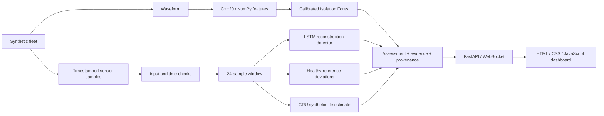

# ARGUS-NEURO

**Evidence-driven diagnostics for power electronics: C++20 signal processing, Python ML models, and a live fleet dashboard.**

[Русская версия](README.ru.md) · [Diagnostic contract](docs/RELIABILITY.md) · [Evaluation notes](experiments/2026-09-30_reliability/notes.md)

ARGUS-NEURO is a working research prototype for marine converters and UAV power-distribution units. The current application runs a six-asset **synthetic fleet**. It does not ingest real equipment telemetry or establish real-world remaining useful life.

## Implemented capabilities

- **Decision passports.** Assessments include a content-derived ID, a model-bundle fingerprint, sensor evidence, and explanations. These identify the evaluated content and models; they are not digital signatures or proof of a fault's cause.
- **Explicit abstention.** Missing/non-finite readings, invalid waveforms, time discontinuities, incompatible models, and insufficient history produce explicit statuses instead of fabricated predictions.
- **Sensor-reference diagnostics.** Equipment-specific healthy training references detect persistent and alternating deviations. References remain fixed during inference, so a degrading asset is not silently learned as normal.
- **Detector disagreement.** The dashboard shows when spectral, reconstruction, and reference-based detectors disagree. A positive detector can raise an alert without requiring a majority vote.
- **Consistent native and NumPy features.** The 11 statistical/spectral features use a shared zero-padded FFT contract. The pybind11 extension supports strided/reversed arrays and releases the GIL after copying its input.
- **Connection-aware monitoring.** The dashboard marks disconnected or stale feeds, retains the last snapshot, and retries the connection. Browser-generated telemetry starts only through an explicit demo action and has a separate source label.

These are implemented product choices, not claims of worldwide novelty or validated industrial performance.

## Architecture



The six sensor channels are `voltage_v`, `current_a`, `temperature_c`, `vibration_g`, `frequency_hz`, and `load_factor`, in that order. The simulator supports overheating, bearing wear, voltage sag, frequency drift, and insulation degradation. The live fleet demonstrates four fault scenarios and two healthy assets.

## Requirements

The project has been exercised on Ubuntu/Linux with CPython 3.12, GCC 13, CMake 3.28, and Node.js 22. Building the native extension requires a C++20 compiler and Python development headers. Python must support creating virtual environments. Node is needed only for dashboard tests, not for serving the application.

Direct Python dependency versions are pinned in [python/requirements.txt](python/requirements.txt); [python/requirements-dev.txt](python/requirements-dev.txt) additionally installs Ruff. This is not a complete transitive dependency lock. Training records the versions of its main numerical libraries in the bundle reports.

## First setup on Ubuntu

Run from the repository root:

```bash
bash scripts/setup_env.sh
bash scripts/train_all.sh
bash scripts/run_dashboard.sh
```

1. Setup creates `.venv` when needed, installs dependencies, and builds the native extension.
2. Training creates and validates a new model bundle before activating it.
3. The launcher uses the project's `.venv` when available and starts Uvicorn on loopback.

Open [http://127.0.0.1:8000](http://127.0.0.1:8000). Keep the terminal open; stop the server with **Ctrl+C**. The launcher changes to the repository directory, so an absolute script path also works from another directory.

For an already configured checkout, only the launcher is needed:

```bash
bash scripts/run_dashboard.sh
```

There is no need to retrain on every startup. After updating from the historical demo weights, run training once: those weights lack the current bundle metadata and are not accepted by the new loader.

### What appears after startup

The server advances simulated telemetry approximately every **1.5 seconds plus computation time**. Each simulated sample represents **5 seconds** of equipment time. Models need 24 consecutive samples; starting from an empty buffer, warmup takes roughly 35–40 wall-clock seconds on the tested machine, depending on processing time.

The first waveform alarm can appear before warmup finishes. Trend health and life estimates remain unavailable until there is sufficient history. Each scenario repeats after 400 samples; its history is reset at that boundary.

### Configuration

| Variable | Default | Purpose |
|---|---|---|
| `ARGUS_HOST` | `127.0.0.1` | Uvicorn bind address |
| `ARGUS_PORT` | `8000` | HTTP and WebSocket port |
| `ARGUS_ARTIFACTS_DIR` | Active local bundle, otherwise `artifacts/` | Explicitly select a trusted model directory; an absolute path is recommended |
| `ARGUS_PYTHON` | Project `.venv/bin/python`, otherwise `python3` | Interpreter used by build/train/run scripts; use an executable path for an override. During initial setup, the default venv creator is `python3`. |
| `OMP_NUM_THREADS`, `MKL_NUM_THREADS` | `1` in train/run launchers | CPU thread limits; existing values are preserved |

For example, to use another local port:

```bash
ARGUS_PORT=8001 bash scripts/run_dashboard.sh
```

The demo has no authentication or tenant isolation. Changing its bind address does not make it suitable for public deployment.

## Diagnostic contract

| Assessment status | Meaning |
|---|---|
| `warming_up` | Valid inputs, but fewer than 24 samples are available |
| `ready` | The full diagnostic path ran with a matching sensor reference |
| `invalid_data` | Sensor values, waveform, or measurement timing failed validation |
| `degraded` | Models/reference data are unavailable or a model returned invalid output |

`ready` describes execution readiness, not proven accuracy on real equipment. `is_anomaly` may be `null`, which means unknown rather than normal. During warmup, a spectral alarm may already set it to `true`.

Invalid sensor input or a discontinuity in supplied timestamps clears the asset's history. The next valid acquisition must rebuild its window. Timestamp checks require callers to pass `sample_time_s`; the demo does so.

Each assessment also includes:

- `data_quality`: issues and the collected/required sample counts;
- `evidence`: the three largest sensor deviations, latest readings, and healthy reference means;
- `explanation` and `detector_disagreement`: diagnostic reasons and conflicting detector decisions;
- `assessment_id` and `model_version`: content and bundle fingerprints;
- `source` and `rul_basis`: measurement and life-estimate provenance.

The reference channel measures window RMS standardized deviation from healthy training data. Its threshold of 6 standard deviations is an explicit heuristic requiring field calibration. It preserves alternating deviations that would cancel in an arithmetic mean. Sensor evidence is not a causal diagnosis.

The health index is a heuristic display score, not a failure probability. The dashboard shows life remaining as a **percentage of a synthetic horizon**. API `rul_hours` uses the horizon recorded during training and is available only for simulation sources; it is not an estimate of real service hours. `rul_interval_normalized` is based on held-out validation residuals and has no guaranteed real-world coverage.

## HTTP and WebSocket API

| Endpoint | Behavior |
|---|---|
| `GET /` | Dashboard, including RU/EN controls |
| `GET /api/health` | Producer state, snapshot age, loaded-model flag, client count, and producer error |
| `GET /api/fleet` | Last completed fleet snapshot; returns 503 before the first snapshot |
| `WS /ws/telemetry` | Initial snapshot when available, followed by fleet updates |
| `GET /docs` | FastAPI's generated HTTP API documentation |

`/api/health` returns 200 when the producer is running and its last snapshot is at most 10 seconds old; otherwise it returns 503. **Inspect `model_backed` separately:** a healthy transport can still deliver assessments with unavailable models. `/api/fleet` can return an old snapshot after a producer failure, so clients should inspect timestamps and health rather than interpreting HTTP 200 as fresh telemetry.

Inference runs in a worker thread with one sequential producer. Each WebSocket client has an independent sender, a three-second send timeout, and a queue containing at most one pending snapshot. Intermediate snapshots can be dropped for slow clients: this is a monitoring feed, not a durable event log.

## Training, artifacts, and ONNX

Whole synthetic trajectories are stratified by asset type and fault **before** scaling or creating overlapping windows. Autoencoder and RUL models have separate scalers fitted on healthy training runs. Calibration uses validation data; final metrics use independent test data. The spectral detector similarly uses separate training, calibration, and test waveform seeds.

`bash scripts/train_all.sh` performs the following steps:

1. Create a fresh `artifacts/run-*` directory.
2. Train the spectral baseline and LSTM autoencoder, including sensor references.
3. Train the GRU and record its synthetic time scale and residual interval.
4. Export both deep models to ONNX, structurally validate them, and compare their outputs against PyTorch.
5. Validate loading the new bundle and atomically update `artifacts/active.json`.

A failed training or validation leaves the previous active pointer intact. Existing weights and failed-run directories are preserved. Restart a running server to load a newly activated bundle. An explicit `ARGUS_ARTIFACTS_DIR` takes precedence over the active pointer; unset it to follow newly activated bundles.

Bundles contain model weights, both scalers, healthy references, metadata, training reports, ONNX files, and an ONNX validation report. The loader checks schema version, sensor order, window length, sampling interval, checksums, and sklearn deserialization compatibility. Use only trusted bundles: joblib is not a safe interchange format for untrusted model files.

The fixed ONNX input is `(1, 24, 6)`. Numerical verification uses **ONNX ReferenceEvaluator** at three input scales. A C++ ONNX Runtime inference bridge and validation on target edge hardware are not implemented.

Generated bundles and `active.json` are ignored by Git. They are local outputs; a fresh checkout needs its own training run or an explicitly supplied compatible bundle.

## Build and tests

After setup, run from the repository root:

```bash
source .venv/bin/activate
bash scripts/build_cpp_core.sh
ctest --test-dir build --output-on-failure

# Native extension and Python contracts
PYTHONPATH="$PWD/python:$PWD/build/cpp_core" OMP_NUM_THREADS=1 MKL_NUM_THREADS=1 \
  python -m pytest python/tests -q

# Fallback without the build directory on Python's module path
PYTHONPATH="$PWD/python" OMP_NUM_THREADS=1 MKL_NUM_THREADS=1 \
  python -m pytest python/tests -q

ruff check python
ruff format --check python
node --check web/dashboard/app.js
node --test web/dashboard/tests/*.test.cjs
```

Native tests remain active in Release. Python tests cover feature parity and edge cases, models, independent run splitting, provenance and abstention, and WebSocket failure behavior. Native-only tests skip when the extension is unavailable. The fallback check assumes `argus_core` has not also been installed into the Python environment.

[CI](.github/workflows/ci.yml) uses Python 3.12 and Node 22, builds the extension, runs both Python modes, checks formatting/dashboard logic, and validates the complete staged training/export workflow.

### Recorded evaluation

The [2026-09-30 experiment](experiments/2026-09-30_reliability/notes.md) records:

| Check or metric | Recorded result |
|---|---|
| Native CTest | 1 test executable passed |
| Python with native extension | 65 passed |
| Python with NumPy fallback | 50 passed, 15 native-only skips |
| Dashboard logic | 3 Node tests passed |
| Autoencoder F1 / recall | 0.6690 / 0.5851 on held-out synthetic runs |
| RUL normalized test MAE | 0.1875; median-target baseline 0.2880 on the same test set |
| ONNX maximum absolute difference | Below 0.000001 for both models in the recorded parity checks |
| 401-step demo | All four faulty assets flagged and both healthy assets unflagged at the final scenario step; the next cycle returned to warmup |

These are dated results, not promised outcomes for other environments or real equipment. The final-step demo check is not a sensitivity/false-alarm study. Original and revised ML metrics use different partitions and should not be interpreted as a controlled accuracy improvement. The recorded visual browser check was unavailable; DOM logic and HTTP/WebSocket transport were checked programmatically.

## Troubleshooting

- **`GET /favicon.ico 404`:** no favicon is supplied. It does not affect diagnostics or telemetry.
- **Life/health values show a dash:** inspect the status. Warmup and unavailable models intentionally withhold predictions.
- **`models_unavailable`:** run the training workflow, verify the selected bundle, and restart. Historical root-level demo weights do not satisfy the new schema.
- **Address already in use:** stop the server you started with Ctrl+C, or choose another `ARGUS_PORT`.
- **Disconnected/stale feed:** the UI preserves the last snapshot and retries. The explicit browser-demo button generates illustrations without using trained models; it does not reconnect real telemetry.
- **Opening `index.html` directly:** the page can run the explicit browser demo, but use the server URL for model-backed diagnostics.
- **Dependency or serialization mismatch:** use the project's virtual environment and retrain with its pinned dependencies. Do not silently reuse an incompatible bundle.

## Repository layout

| Path | Contents |
|---|---|
| `cpp_core/` | Feature extraction, radix-2 FFT, pybind11 bindings, native tests |
| `python/argus/simulator/` | Synthetic telemetry and waveform generation |
| `python/argus/features/`, `models/` | Native/NumPy interface and model definitions |
| `python/argus/training/` | Run splitting, scalers, training, reproducibility helpers |
| `python/argus/inference/`, `python/argus/artifacts.py` | Assessments and active-bundle resolution |
| `python/argus/api/`, `python/argus/export/` | FastAPI service and verified ONNX export |
| `python/tests/` | Python regression tests |
| `web/dashboard/` | Bilingual HTML/CSS/JS console and Node tests; no frontend build system |
| `artifacts/` | Historical demo files and locally generated bundles |
| `scripts/` | Environment setup, build, staged training, local launch |
| `experiments/` | Configurations, metrics, change snapshots, and evaluation notes |
| `docs/RELIABILITY.md` | Diagnostic decisions, failure behavior, and deployment boundaries |

## Current boundaries and next steps

Real telemetry adapters, durable history, authentication, tenant isolation, and a C++ ONNX Runtime inference bridge remain future work. Priorities for field validation are timestamped acquisition, engineering-labelled faults, independent physical assets for testing, acceptable false-alarm rates, and warning-time measurements. Drift monitoring and long-duration network/device failure tests are also needed before industrial operation.

## Author and license

Сергеев Антон Валентинович (Anton Valentinovich Sergeev). Licensed under MIT; see [LICENSE](LICENSE).
