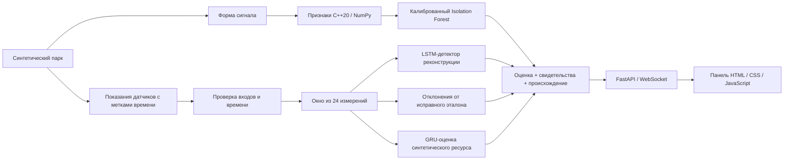

# ARGUS-NEURO

**Диагностика силовой электроники на основе свидетельств: обработка сигналов на C++20, ML-модели на Python и живая панель мониторинга парка.**

**Русский** · [English](README.en.md) · [中文](README.zh.md) · [हिन्दी](README.hi.md) · [Español](README.es.md) · [Français](README.fr.md) · [Deutsch](README.de.md) · [Italiano](README.it.md)

[Контракт диагностики](docs/RELIABILITY.md) · [Заметки об оценке](experiments/2026-09-30_reliability/notes.md)

ARGUS-NEURO — работающий исследовательский прототип для морских преобразователей и блоков распределения питания БПЛА. Текущее приложение обслуживает **синтетический парк** из шести активов. Оно не принимает телеметрию реального оборудования и не определяет реальный остаточный ресурс.

## Реализованные возможности

- **Паспорта решений.** Каждая оценка содержит идентификатор, вычисленный по содержимому, отпечаток набора моделей, свидетельства датчиков и пояснения. Они идентифицируют оценённые данные и модели; это не цифровая подпись и не доказательство причины неисправности.
- **Явный отказ от прогноза.** Отсутствующие или нечисловые показания, некорректная форма сигнала, разрывы во времени, несовместимые модели и недостаточная история дают явные статусы вместо выдуманных прогнозов.
- **Диагностика относительно эталона датчиков.** Эталоны исправного состояния, свои для каждого типа оборудования, выявляют устойчивые и знакопеременные отклонения. Во время инференса эталоны не меняются, поэтому деградирующий актив не начинает незаметно считаться нормой.
- **Расхождение детекторов.** Панель показывает, когда спектральный, реконструкционный и эталонный детекторы расходятся. Тревогу может поднять один сработавший детектор, без голосования большинством.
- **Согласованные признаки в C++ и NumPy.** 11 статистических и спектральных признаков используют общий контракт БПФ с дополнением нулями. Расширение pybind11 поддерживает массивы с шагом и в обратном порядке и освобождает GIL после копирования входа.
- **Мониторинг с учётом связи.** Панель помечает отключённые и устаревшие потоки, сохраняет последний снимок и повторяет подключение. Телеметрия, сгенерированная в браузере, запускается только явным действием и имеет отдельную метку источника.
- **Интерфейс на восьми языках.** Русский (по умолчанию), английский, китайский, хинди, испанский, французский, немецкий и итальянский; выбранный язык запоминается в браузере.

Это реализованные проектные решения, а не заявления о мировой новизне или подтверждённой промышленной эффективности.

## Архитектура



Шесть каналов датчиков — `voltage_v`, `current_a`, `temperature_c`, `vibration_g`, `frequency_hz` и `load_factor`, именно в этом порядке. Симулятор поддерживает перегрев, износ подшипников, просадку напряжения, дрейф частоты и деградацию изоляции. Живой парк демонстрирует четыре сценария неисправностей и два исправных актива.

## Требования

Проект проверен на Ubuntu/Linux с CPython 3.12, GCC 13, CMake 3.28 и Node.js 22. Для сборки нативного расширения нужен компилятор C++20 и заголовочные файлы Python для разработки. Python должен уметь создавать виртуальные окружения. Node нужен только для тестов панели, а не для работы приложения.

Версии прямых Python-зависимостей закреплены в [python/requirements.txt](python/requirements.txt); [python/requirements-dev.txt](python/requirements-dev.txt) дополнительно устанавливает Ruff. Это не полная фиксация транзитивных зависимостей. Обучение записывает версии основных вычислительных библиотек в отчёты набора моделей.

## Первая установка на Ubuntu

Выполните из корня репозитория:

```bash
bash scripts/setup_env.sh
bash scripts/train_all.sh
bash scripts/run_dashboard.sh
```

1. Установка при необходимости создаёт `.venv`, устанавливает зависимости и собирает нативное расширение.
2. Обучение создаёт и проверяет новый набор моделей и только затем активирует его.
3. Скрипт запуска использует `.venv` проекта, если оно есть, и запускает Uvicorn на локальном адресе.

Откройте [http://127.0.0.1:8000](http://127.0.0.1:8000). Не закрывайте терминал; сервер останавливается сочетанием **Ctrl+C**. Скрипт запуска сам переходит в каталог репозитория, поэтому его можно вызывать по абсолютному пути из любого каталога.

Для уже настроенной копии нужен только скрипт запуска:

```bash
bash scripts/run_dashboard.sh
```

Переобучать модели при каждом запуске не нужно. После обновления со старых демонстрационных весов выполните обучение один раз: в этих весах нет метаданных текущего формата, и новый загрузчик их не принимает.

### Что видно после запуска

Сервер продвигает симулированную телеметрию примерно каждые **1,5 секунды плюс время вычислений**. Каждое симулированное измерение соответствует **5 секундам** работы оборудования. Моделям нужно 24 последовательных измерения; с пустого буфера прогрев занимает примерно 35–40 секунд на проверенной машине, в зависимости от скорости обработки.

Первая тревога по форме сигнала может появиться ещё до окончания прогрева. Индекс здоровья по тренду и оценка ресурса недоступны, пока не накоплена достаточная история. Каждый сценарий повторяется через 400 измерений; на этой границе его история сбрасывается.

### Настройка

| Переменная | По умолчанию | Назначение |
|---|---|---|
| `ARGUS_HOST` | `127.0.0.1` | Адрес, на котором слушает Uvicorn |
| `ARGUS_PORT` | `8000` | Порт HTTP и WebSocket |
| `ARGUS_ARTIFACTS_DIR` | Активный локальный набор, иначе `artifacts/` | Явный выбор доверенного каталога моделей; рекомендуется абсолютный путь |
| `ARGUS_PYTHON` | `.venv/bin/python` проекта, иначе `python3` | Интерпретатор для скриптов сборки, обучения и запуска; для замены укажите путь к исполняемому файлу. При первой установке виртуальное окружение по умолчанию создаётся через `python3`. |
| `OMP_NUM_THREADS`, `MKL_NUM_THREADS` | `1` в скриптах обучения и запуска | Ограничение потоков CPU; уже заданные значения сохраняются |

Например, чтобы использовать другой локальный порт:

```bash
ARGUS_PORT=8001 bash scripts/run_dashboard.sh
```

В демонстрации нет аутентификации и изоляции арендаторов. Смена адреса прослушивания не делает её пригодной для публичного развёртывания.

## Контракт диагностики

| Статус оценки | Значение |
|---|---|
| `warming_up` | Входы корректны, но доступно меньше 24 измерений |
| `ready` | Полный диагностический путь выполнен с подходящим эталоном датчиков |
| `invalid_data` | Значения датчиков, форма сигнала или время измерений не прошли проверку |
| `degraded` | Модели или эталонные данные недоступны, либо модель вернула некорректный результат |

`ready` означает готовность к выполнению, а не доказанную точность на реальном оборудовании. `is_anomaly` может быть `null` — это «неизвестно», а не «норма». Во время прогрева спектральная тревога уже может установить значение `true`.

Некорректные показания датчиков или разрыв в переданных метках времени очищают историю актива. Следующее корректное измерение начинает заполнять окно заново. Для проверки времени вызывающая сторона должна передавать `sample_time_s`; демонстрация это делает.

Каждая оценка также содержит:

- `data_quality`: обнаруженные проблемы и число собранных и требуемых измерений;
- `evidence`: три наибольших отклонения датчиков, последние показания и средние значения исправного эталона;
- `explanation` и `detector_disagreement`: причины диагноза и противоречащие решения детекторов;
- `assessment_id` и `model_version`: отпечатки содержимого и набора моделей;
- `source` и `rul_basis`: происхождение измерений и оценки ресурса.

Эталонный канал измеряет среднеквадратичное стандартизированное отклонение окна от исправных обучающих данных. Порог в 6 стандартных отклонений — явная эвристика, требующая калибровки в полевых условиях. Знакопеременные отклонения при этом не гасят друг друга, как при арифметическом усреднении. Свидетельства датчиков не являются причинным диагнозом.

Индекс здоровья — эвристическая оценка для отображения, а не вероятность отказа. Панель показывает остаточный ресурс как **процент синтетического горизонта**. Поле API `rul_hours` использует горизонт, записанный при обучении, и доступно только для симулированных источников; это не оценка реальных часов эксплуатации. `rul_interval_normalized` основан на остатках отложенной валидационной выборки и не гарантирует покрытия на реальном оборудовании.

## HTTP и WebSocket API

| Адрес | Поведение |
|---|---|
| `GET /` | Панель на восьми языках (по умолчанию RU, а также EN, ZH, HI, ES, FR, DE, IT) |
| `GET /api/health` | Состояние генератора, возраст снимка, признак загруженных моделей, число клиентов и ошибка генератора |
| `GET /api/fleet` | Последний завершённый снимок парка; до первого снимка возвращает 503 |
| `WS /ws/telemetry` | Начальный снимок, если он есть, затем обновления парка |
| `GET /docs` | Автоматическая документация HTTP API от FastAPI |

`/api/health` возвращает 200, когда генератор работает, а последний снимок не старше 10 секунд; иначе — 503. **Проверяйте `model_backed` отдельно:** исправный транспорт может доставлять оценки и при недоступных моделях. После сбоя генератора `/api/fleet` может вернуть старый снимок, поэтому клиентам следует смотреть на метки времени и состояние, а не считать HTTP 200 признаком свежей телеметрии.

Инференс выполняется в рабочем потоке с одним последовательным генератором. У каждого WebSocket-клиента свой отправитель, тайм-аут отправки три секунды и очередь не более чем из одного ожидающего снимка. Медленные клиенты могут пропускать промежуточные снимки: это поток мониторинга, а не надёжный журнал событий.

## Обучение, артефакты и ONNX

Целые синтетические траектории стратифицируются по типу актива и неисправности **до** масштабирования и построения перекрывающихся окон. У автоэнкодера и модели ресурса свои нормализаторы, обученные на исправных обучающих прогонах. Калибровка использует валидационные данные, итоговые метрики — независимые тестовые. Спектральный детектор аналогично использует отдельные seed форм сигнала для обучения, калибровки и теста.

`bash scripts/train_all.sh` выполняет следующие шаги:

1. Создаёт новый каталог `artifacts/run-*`.
2. Обучает спектральный базовый детектор и LSTM-автоэнкодер, включая эталоны датчиков.
3. Обучает GRU и записывает его синтетическую шкалу времени и интервал по остаткам.
4. Экспортирует обе глубокие модели в ONNX, проверяет их структуру и сравнивает выходы с PyTorch.
5. Проверяет загрузку нового набора и атомарно обновляет `artifacts/active.json`.

Неудачное обучение или проверка оставляет прежний активный указатель нетронутым. Существующие веса и каталоги неудачных запусков сохраняются. Чтобы загрузить новый активированный набор, перезапустите работающий сервер. Явно заданная `ARGUS_ARTIFACTS_DIR` имеет приоритет над активным указателем; уберите её, чтобы автоматически использовать новые наборы.

Набор содержит веса моделей, оба нормализатора, исправные эталоны, метаданные, отчёты обучения, файлы ONNX и отчёт о проверке ONNX. Загрузчик проверяет версию схемы, порядок датчиков, длину окна, интервал измерений, контрольные суммы и совместимость десериализации sklearn. Используйте только доверенные наборы: joblib не является безопасным форматом обмена для недоверенных файлов моделей.

Фиксированный вход ONNX — `(1, 24, 6)`. Численная проверка использует **ONNX ReferenceEvaluator** на трёх масштабах входа. Мост инференса ONNX Runtime на C++ и проверка на целевом бортовом оборудовании не реализованы.

Сгенерированные наборы и `active.json` игнорируются Git. Это локальные результаты; новой копии репозитория нужен собственный запуск обучения или явно переданный совместимый набор.

## Сборка и тесты

После установки выполните из корня репозитория:

```bash
source .venv/bin/activate
bash scripts/build_cpp_core.sh
ctest --test-dir build --output-on-failure

# Нативное расширение и контракты Python
PYTHONPATH="$PWD/python:$PWD/build/cpp_core" OMP_NUM_THREADS=1 MKL_NUM_THREADS=1 \
  python -m pytest python/tests -q

# Резервный режим без каталога сборки в пути модулей Python
PYTHONPATH="$PWD/python" OMP_NUM_THREADS=1 MKL_NUM_THREADS=1 \
  python -m pytest python/tests -q

ruff check python
ruff format --check python
node --check web/dashboard/app.js
node --test web/dashboard/tests/*.test.cjs
```

Нативные тесты остаются активными в сборке Release. Тесты Python покрывают совпадение признаков и граничные случаи, модели, независимое разбиение прогонов, происхождение и отказ от прогноза, а также поведение WebSocket при сбоях. Тесты только для нативного расширения пропускаются, если оно недоступно. Проверка резервного режима предполагает, что `argus_core` не установлен в окружение Python отдельно.

[CI](.github/workflows/ci.yml) использует Python 3.12 и Node 22, собирает расширение, запускает оба режима Python, проверяет форматирование и логику панели и прогоняет весь поэтапный процесс обучения и экспорта.

### Зафиксированная оценка

[Эксперимент от 30.09.2026](experiments/2026-09-30_reliability/notes.md) зафиксировал:

| Проверка или метрика | Зафиксированный результат |
|---|---|
| Нативный CTest | 1 исполняемый тест пройден |
| Python с нативным расширением | 65 пройдено |
| Python с резервным NumPy | 50 пройдено, 15 нативных тестов пропущено |
| Логика панели | 3 теста Node пройдено |
| F1 / полнота автоэнкодера | 0,6690 / 0,5851 на отложенных синтетических прогонах |
| Нормированная MAE ресурса на тесте | 0,1875; базовый прогноз медианой — 0,2880 на той же выборке |
| Максимальная абсолютная разница ONNX | Меньше 0,000001 для обеих моделей в зафиксированных проверках |
| Демонстрация на 401 шаг | На последнем шаге сценария отмечены все четыре неисправных актива, оба исправных не отмечены; следующий цикл вернулся к прогреву |

Это датированные результаты, а не обещание таких же итогов в других окружениях или на реальном оборудовании. Проверка последнего шага демонстрации не является исследованием чувствительности или ложных тревог. Исходные и пересмотренные ML-метрики получены на разных разбиениях и не должны трактоваться как контролируемое улучшение точности. Визуальная проверка в браузере в тот момент была недоступна; логика DOM и транспорт HTTP/WebSocket проверены программно.

## Устранение неполадок

- **`GET /favicon.ico 404`:** значок сайта не поставляется. На диагностику и телеметрию это не влияет.
- **Вместо ресурса или здоровья прочерк:** посмотрите на статус. Во время прогрева и при недоступных моделях прогнозы намеренно не выдаются.
- **`models_unavailable`:** запустите обучение, проверьте выбранный набор и перезапустите сервер. Старые демонстрационные веса в корне `artifacts/` не соответствуют новой схеме.
- **Адрес уже занят:** остановите ранее запущенный сервер сочетанием Ctrl+C или выберите другой `ARGUS_PORT`.
- **Связь потеряна / данные устарели:** интерфейс сохраняет последний снимок и повторяет подключение. Кнопка демонстрации в браузере генерирует иллюстрацию без обученных моделей; она не восстанавливает реальную телеметрию.
- **Открытие `index.html` напрямую:** страница может запустить демонстрацию в браузере, но для диагностики с моделями используйте адрес сервера.
- **Несовпадение зависимостей или сериализации:** используйте виртуальное окружение проекта и переобучите модели с закреплёнными зависимостями. Не используйте несовместимый набор моделей.

## Структура репозитория

| Путь | Содержимое |
|---|---|
| `cpp_core/` | Извлечение признаков, БПФ radix-2, привязки pybind11, нативные тесты |
| `python/argus/simulator/` | Генерация синтетической телеметрии и форм сигнала |
| `python/argus/features/`, `models/` | Интерфейс C++/NumPy и определения моделей |
| `python/argus/training/` | Разбиение прогонов, нормализаторы, обучение, средства воспроизводимости |
| `python/argus/inference/`, `python/argus/artifacts.py` | Оценки и выбор активного набора моделей |
| `python/argus/api/`, `python/argus/export/` | Сервис FastAPI и проверенный экспорт в ONNX |
| `python/tests/` | Регрессионные тесты Python |
| `web/dashboard/` | Многоязычная консоль HTML/CSS/JS и тесты Node; без сборщика фронтенда |
| `artifacts/` | Исторические демонстрационные файлы и локально созданные наборы |
| `scripts/` | Настройка окружения, сборка, поэтапное обучение, локальный запуск |
| `experiments/` | Конфигурации, метрики, снимки изменений и заметки об оценке |
| `docs/RELIABILITY.md` | Диагностические решения, поведение при сбоях и границы применения |

## Текущие границы и дальнейшие шаги

Адаптеры реальной телеметрии, постоянное хранение истории, аутентификация, изоляция арендаторов и мост инференса ONNX Runtime на C++ остаются задачами на будущее. Приоритеты полевой валидации: сбор данных с метками времени, неисправности с инженерной разметкой, независимые физические активы для тестирования, допустимая частота ложных тревог и измерение времени упреждения. До промышленной эксплуатации также нужны мониторинг дрейфа и длительные испытания на сбои сети и устройств.

## Автор и лицензия

Сергеев Антон Валентинович. Лицензия MIT — см. [LICENSE](LICENSE).
