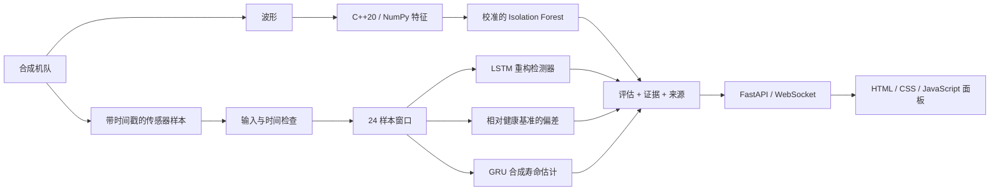

# ARGUS-NEURO

**基于证据的电力电子诊断：C++20 信号处理、Python 机器学习模型与实时机队监控面板。**

[Русский](README.md) · [English](README.en.md) · **中文** · [हिन्दी](README.hi.md) · [Español](README.es.md) · [Français](README.fr.md) · [Deutsch](README.de.md) · [Italiano](README.it.md)

[诊断契约（英文）](docs/RELIABILITY.md) · [评估记录（英文）](experiments/2026-09-30_reliability/notes.md)

ARGUS-NEURO 是一个可运行的研究原型，面向船舶变流器和无人机配电单元。当前应用运行一个由六台资产组成的**合成机队**。它不接入真实设备遥测数据，也不确定真实的剩余使用寿命。

## 已实现的功能

- **决策档案。** 每次评估都包含基于内容生成的 ID、模型包指纹、传感器证据和解释。它们用于标识被评估的内容和模型；不是数字签名，也不能证明故障原因。
- **明确放弃预测。** 缺失或非有限的读数、无效波形、时间不连续、不兼容的模型以及历史数据不足，都会产生明确的状态，而不是编造预测。
- **基于传感器基准的诊断。** 按设备类型建立的健康训练基准可检测持续性偏差和交变偏差。推理期间基准保持不变，因此正在退化的资产不会被悄然学成"正常"。
- **检测器分歧。** 面板会显示频谱、重构和基准检测器之间的分歧。任一检测器为阳性即可触发告警，无需多数表决。
- **一致的原生与 NumPy 特征。** 11 个统计和频谱特征使用统一的补零 FFT 约定。pybind11 扩展支持带步长和反向的数组，并在复制输入后释放 GIL。
- **感知连接状态的监控。** 面板会标记断开或过时的数据流，保留最后一次快照并自动重连。浏览器生成的遥测只能通过明确的演示操作启动，并带有单独的来源标签。
- **八种语言的界面。** 俄语（默认）、英语、中文、印地语、西班牙语、法语、德语和意大利语；所选语言会保存在浏览器中。

以上是已实现的产品设计选择，并非宣称全球首创或已验证的工业性能。

## 架构



六个传感器通道依次为 `voltage_v`、`current_a`、`temperature_c`、`vibration_g`、`frequency_hz` 和 `load_factor`。模拟器支持过热、轴承磨损、电压骤降、频率漂移和绝缘老化。实时机队演示四种故障场景和两台健康资产。

## 环境要求

项目已在 Ubuntu/Linux 上使用 CPython 3.12、GCC 13、CMake 3.28 和 Node.js 22 验证。构建原生扩展需要 C++20 编译器和 Python 开发头文件。Python 必须支持创建虚拟环境。Node 仅用于面板测试，运行应用时不需要。

Python 直接依赖的版本固定在 [python/requirements.txt](python/requirements.txt) 中；[python/requirements-dev.txt](python/requirements-dev.txt) 额外安装 Ruff。这并不是完整的传递依赖锁定。训练过程会把主要数值计算库的版本记录到模型包报告中。

## 在 Ubuntu 上首次安装

在仓库根目录运行：

```bash
bash scripts/setup_env.sh
bash scripts/train_all.sh
bash scripts/run_dashboard.sh
```

1. 安装脚本在需要时创建 `.venv`，安装依赖并构建原生扩展。
2. 训练会创建并验证新的模型包，然后才将其激活。
3. 启动脚本优先使用项目的 `.venv`，并在本地回环地址上启动 Uvicorn。

打开 [http://127.0.0.1:8000](http://127.0.0.1:8000)。请保持终端开启；按 **Ctrl+C** 停止服务器。启动脚本会自动切换到仓库目录，因此也可以从其他目录用绝对路径调用。

对于已配置好的副本，只需运行启动脚本：

```bash
bash scripts/run_dashboard.sh
```

无需每次启动都重新训练。从历史演示权重升级后，请运行一次训练：这些权重缺少当前模型包的元数据，新的加载器不会接受它们。

### 启动后会看到什么

服务器大约每 **1.5 秒加上计算时间** 推进一次模拟遥测。每个模拟样本代表设备运行的 **5 秒**。模型需要 24 个连续样本；从空缓冲区开始，在测试机器上预热大约需要 35–40 秒（取决于处理时间）。

第一个波形告警可能在预热结束前出现。在历史数据足够之前，趋势健康指数和寿命估计不可用。每个场景每 400 个样本重复一次；在该边界处其历史会被重置。

### 配置

| 变量 | 默认值 | 用途 |
|---|---|---|
| `ARGUS_HOST` | `127.0.0.1` | Uvicorn 监听地址 |
| `ARGUS_PORT` | `8000` | HTTP 和 WebSocket 端口 |
| `ARGUS_ARTIFACTS_DIR` | 当前激活的本地模型包，否则为 `artifacts/` | 显式指定受信任的模型目录；建议使用绝对路径 |
| `ARGUS_PYTHON` | 项目的 `.venv/bin/python`，否则为 `python3` | 构建、训练和运行脚本使用的解释器；覆盖时请提供可执行文件路径。首次安装时，默认用 `python3` 创建虚拟环境。 |
| `OMP_NUM_THREADS`、`MKL_NUM_THREADS` | 训练和运行脚本中为 `1` | CPU 线程限制；已设置的值会被保留 |

例如，使用另一个本地端口：

```bash
ARGUS_PORT=8001 bash scripts/run_dashboard.sh
```

演示没有身份验证和租户隔离。更改监听地址并不能使其适合公开部署。

## 诊断契约

| 评估状态 | 含义 |
|---|---|
| `warming_up` | 输入有效，但样本少于 24 个 |
| `ready` | 完整诊断流程已使用匹配的传感器基准运行 |
| `invalid_data` | 传感器数值、波形或测量时间未通过校验 |
| `degraded` | 模型或基准数据不可用，或模型返回了无效输出 |

`ready` 表示具备执行条件，并不代表在真实设备上已证明的准确性。`is_anomaly` 可能为 `null`，表示未知而非正常。预热期间，频谱告警可能已将其设为 `true`。

无效的传感器输入或所提供时间戳的不连续会清空该资产的历史。下一次有效采集必须重新构建窗口。时间戳检查要求调用方传入 `sample_time_s`；演示会传入该值。

每次评估还包括：

- `data_quality`：问题列表以及已收集/所需的样本数；
- `evidence`：三个最大的传感器偏差、最新读数和健康基准均值；
- `explanation` 和 `detector_disagreement`：诊断原因和相互矛盾的检测器结论；
- `assessment_id` 和 `model_version`：内容指纹和模型包指纹；
- `source` 和 `rul_basis`：测量来源和寿命估计依据。

基准通道衡量窗口相对健康训练数据的均方根标准化偏差。6 个标准差的阈值是一个明确的经验值，需要现场校准。它能保留在算术平均中会相互抵消的交变偏差。传感器证据不是因果诊断。

健康指数是用于显示的经验评分，不是故障概率。面板以**合成时间范围的百分比**显示剩余寿命。API 中的 `rul_hours` 使用训练时记录的时间范围，仅对模拟来源提供；它不是真实运行小时数的估计。`rul_interval_normalized` 基于留出验证集的残差，不保证在真实环境中的覆盖率。

## HTTP 与 WebSocket API

| 端点 | 行为 |
|---|---|
| `GET /` | 八种语言的面板（默认 RU，另有 EN、ZH、HI、ES、FR、DE、IT） |
| `GET /api/health` | 生成器状态、快照时长、模型加载标志、客户端数量和生成器错误 |
| `GET /api/fleet` | 最近一次完整的机队快照；在第一个快照之前返回 503 |
| `WS /ws/telemetry` | 若有则先发送初始快照，随后推送机队更新 |
| `GET /docs` | FastAPI 自动生成的 HTTP API 文档 |

当生成器正在运行且最近快照不超过 10 秒时，`/api/health` 返回 200；否则返回 503。**请单独检查 `model_backed`：** 传输正常时，评估仍可能在模型不可用的情况下产生。生成器失败后，`/api/fleet` 可能返回旧快照，因此客户端应检查时间戳和健康状态，而不是把 HTTP 200 当作新鲜遥测。

推理在工作线程中运行，只有一个顺序生成器。每个 WebSocket 客户端有独立的发送器、三秒发送超时以及最多容纳一个待发快照的队列。对于慢速客户端，中间快照可能被丢弃：这是监控数据流，而不是持久化事件日志。

## 训练、产物与 ONNX

完整的合成轨迹在缩放和生成重叠窗口**之前**按资产类型和故障进行分层划分。自编码器和 RUL 模型各自拥有在健康训练运行上拟合的缩放器。校准使用验证数据；最终指标使用独立的测试数据。频谱检测器同样为训练、校准和测试使用不同的波形种子。

`bash scripts/train_all.sh` 执行以下步骤：

1. 创建新的 `artifacts/run-*` 目录。
2. 训练频谱基线检测器和 LSTM 自编码器，并生成传感器基准。
3. 训练 GRU，记录其合成时间尺度和残差区间。
4. 将两个深度模型导出为 ONNX，进行结构校验，并与 PyTorch 输出比对。
5. 验证新模型包可以加载，并原子地更新 `artifacts/active.json`。

训练或验证失败时，原有的激活指针保持不变。已有权重和失败运行的目录都会保留。重启正在运行的服务器即可加载新激活的模型包。显式设置的 `ARGUS_ARTIFACTS_DIR` 优先于激活指针；取消设置它才能跟随新激活的模型包。

模型包包含模型权重、两个缩放器、健康基准、元数据、训练报告、ONNX 文件和 ONNX 校验报告。加载器会检查架构版本、传感器顺序、窗口长度、采样间隔、校验和以及 sklearn 反序列化兼容性。请只使用受信任的模型包：joblib 不是交换不受信任模型文件的安全格式。

固定的 ONNX 输入为 `(1, 24, 6)`。数值校验在三个输入尺度上使用 **ONNX ReferenceEvaluator**。C++ ONNX Runtime 推理桥接以及在目标边缘硬件上的验证尚未实现。

生成的模型包和 `active.json` 会被 Git 忽略。它们是本地输出；全新的副本需要自行训练，或显式提供兼容的模型包。

## 构建与测试

安装完成后，在仓库根目录运行：

```bash
source .venv/bin/activate
bash scripts/build_cpp_core.sh
ctest --test-dir build --output-on-failure

# 原生扩展与 Python 契约
PYTHONPATH="$PWD/python:$PWD/build/cpp_core" OMP_NUM_THREADS=1 MKL_NUM_THREADS=1 \
  python -m pytest python/tests -q

# 不把构建目录加入 Python 模块路径的回退模式
PYTHONPATH="$PWD/python" OMP_NUM_THREADS=1 MKL_NUM_THREADS=1 \
  python -m pytest python/tests -q

ruff check python
ruff format --check python
node --check web/dashboard/app.js
node --test web/dashboard/tests/*.test.cjs
```

原生测试在 Release 构建中依然启用。Python 测试覆盖特征一致性与边界情况、模型、独立的运行划分、来源追踪与放弃预测，以及 WebSocket 故障行为。仅适用于原生扩展的测试在扩展不可用时会被跳过。回退模式检查假定 `argus_core` 没有另外安装到 Python 环境中。

[CI](.github/workflows/ci.yml) 使用 Python 3.12 和 Node 22，构建扩展，运行两种 Python 模式，检查格式和面板逻辑，并验证完整的分阶段训练/导出流程。

### 已记录的评估

[2026-09-30 实验](experiments/2026-09-30_reliability/notes.md) 记录了：

| 检查或指标 | 记录结果 |
|---|---|
| 原生 CTest | 1 个测试程序通过 |
| 使用原生扩展的 Python | 65 个通过 |
| 使用 NumPy 回退的 Python | 50 个通过，15 个仅原生测试被跳过 |
| 面板逻辑 | 3 个 Node 测试通过 |
| 自编码器 F1 / 召回率 | 在留出的合成运行上为 0.6690 / 0.5851 |
| RUL 归一化测试 MAE | 0.1875；同一测试集上中位数基线为 0.2880 |
| ONNX 最大绝对差 | 在记录的一致性检查中两个模型均小于 0.000001 |
| 401 步演示 | 在场景最后一步，四台故障资产全部被标记，两台健康资产均未被标记；下一周期回到预热 |

这些是带日期的结果，并不承诺在其他环境或真实设备上得到相同结论。演示最后一步的检查不是灵敏度/误报研究。原始和修订后的机器学习指标使用了不同的数据划分，不应解读为受控的准确率提升。当时无法进行可视化浏览器检查；DOM 逻辑和 HTTP/WebSocket 传输均已通过程序检查。

## 故障排除

- **`GET /favicon.ico 404`：** 未提供网站图标，不影响诊断和遥测。
- **寿命/健康值显示为短横线：** 请查看状态。预热期间和模型不可用时会有意不给出预测。
- **`models_unavailable`：** 运行训练流程，检查所选模型包并重启。根目录下的历史演示权重不符合新架构。
- **地址已被占用：** 用 Ctrl+C 停止之前启动的服务器，或选择其他 `ARGUS_PORT`。
- **连接断开/数据过时：** 界面会保留最后一次快照并重试连接。浏览器演示按钮生成不使用训练模型的示意数据；它不会恢复真实遥测。
- **直接打开 `index.html`：** 页面可以运行浏览器演示，但要获得基于模型的诊断，请使用服务器地址。
- **依赖或序列化不匹配：** 使用项目的虚拟环境，并用固定版本的依赖重新训练。不要悄悄复用不兼容的模型包。

## 仓库结构

| 路径 | 内容 |
|---|---|
| `cpp_core/` | 特征提取、radix-2 FFT、pybind11 绑定、原生测试 |
| `python/argus/simulator/` | 合成遥测与波形生成 |
| `python/argus/features/`、`models/` | 原生/NumPy 接口与模型定义 |
| `python/argus/training/` | 运行划分、缩放器、训练、可复现性工具 |
| `python/argus/inference/`、`python/argus/artifacts.py` | 评估与激活模型包解析 |
| `python/argus/api/`、`python/argus/export/` | FastAPI 服务与经过校验的 ONNX 导出 |
| `python/tests/` | Python 回归测试 |
| `web/dashboard/` | 多语言 HTML/CSS/JS 控制台与 Node 测试；无前端构建系统 |
| `artifacts/` | 历史演示文件与本地生成的模型包 |
| `scripts/` | 环境配置、构建、分阶段训练、本地启动 |
| `experiments/` | 配置、指标、变更快照与评估记录 |
| `docs/RELIABILITY.md` | 诊断决策、故障行为与部署边界 |

## 当前边界与后续步骤

真实遥测适配器、持久化历史、身份验证、租户隔离以及 C++ ONNX Runtime 推理桥接仍属于后续工作。现场验证的优先事项包括：带时间戳的数据采集、经工程标注的故障、用于测试的独立物理资产、可接受的误报率以及预警时间测量。在工业运行之前，还需要漂移监控以及长时间的网络/设备故障测试。

## 作者与许可证

谢尔盖耶夫·安东·瓦连京诺维奇（Сергеев Антон Валентинович，Anton Valentinovich Sergeev）。采用 MIT 许可证；见 [LICENSE](LICENSE)。
